Class 7: Machine Learning
================
Nicole Chang
4/26/23

# Example of K-means clustering

First step is o make up some data with a known structure, so we know
what the answer should be.

``` r
tmp <- c( rnorm(30, mean = -3), rnorm(30, mean = 3) )
x <- cbind(x = tmp, y = rev(tmp))
plot(x)
```

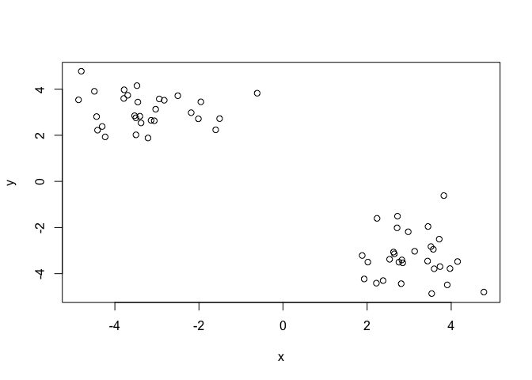

Now we have some structured data in `x`. Let’s see if k-means is able to
identify the two groups.

``` r
k <- kmeans(x, centers = 2, nstart = 20)
k
```

    K-means clustering with 2 clusters of sizes 30, 30

    Cluster means:
              x         y
    1 -2.639384  3.106587
    2  3.106587 -2.639384

    Clustering vector:
     [1] 1 1 1 1 1 1 1 1 1 1 1 1 1 1 1 1 1 1 1 1 1 1 1 1 1 1 1 1 1 1 2 2 2 2 2 2 2 2
    [39] 2 2 2 2 2 2 2 2 2 2 2 2 2 2 2 2 2 2 2 2 2 2

    Within cluster sum of squares by cluster:
    [1] 57.06978 57.06978
     (between_SS / total_SS =  89.7 %)

    Available components:

    [1] "cluster"      "centers"      "totss"        "withinss"     "tot.withinss"
    [6] "betweenss"    "size"         "iter"         "ifault"      

Let’s explore `k`:

``` r
k$size
```

    [1] 30 30

``` r
k$centers
```

              x         y
    1 -2.639384  3.106587
    2  3.106587 -2.639384

``` r
plot(x, col = k$cluster)
```

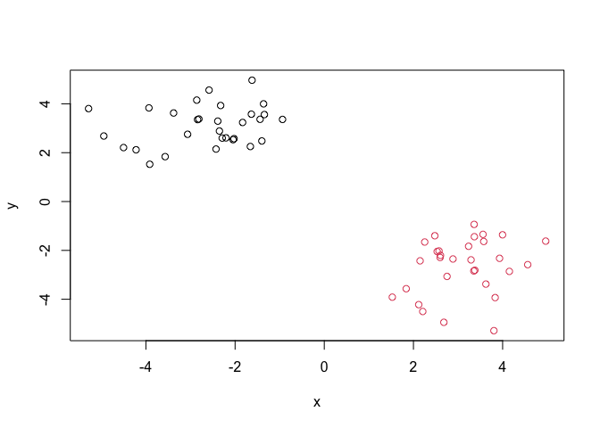

Now we can add the clusters centers:

``` r
plot(x, col = k$cluster)
points(k$centers, col= "blue", pch = 15)
```

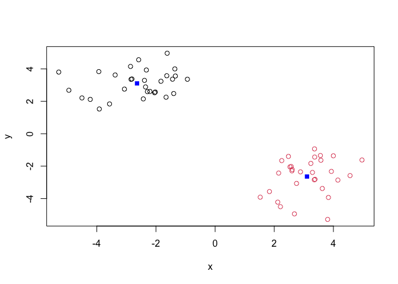

An example when we select the wrong number of cluster for k-means.

``` r
k_3 <- kmeans(x, centers = 3, nstart = 20)
plot(x, col = k_3$cluster)
```

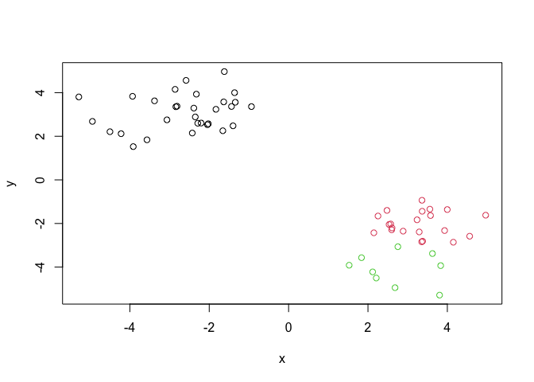

# Example of Hierarchical Clustering

Let’s use the same data as before, which we stored in ‘x’. We will use
the `'hclust()'` function.

``` r
clustering <- hclust( dist(x) )
clustering
```


    Call:
    hclust(d = dist(x))

    Cluster method   : complete 
    Distance         : euclidean 
    Number of objects: 60 

``` r
plot(clustering)
```

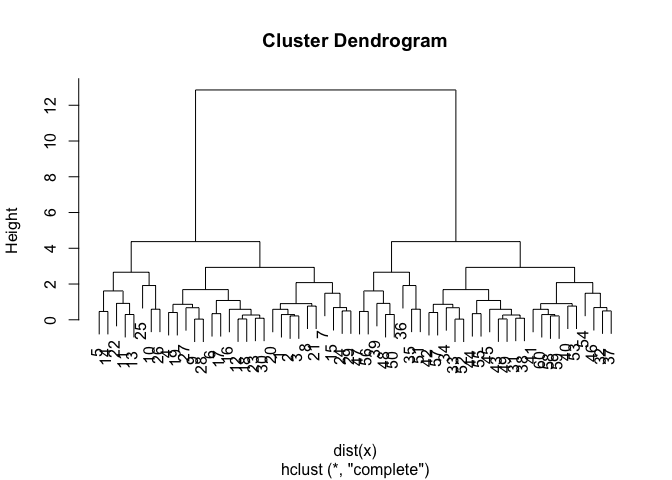

Let’s add a horizontal line

``` r
plot(clustering)
abline(h=10, col="pink")
```

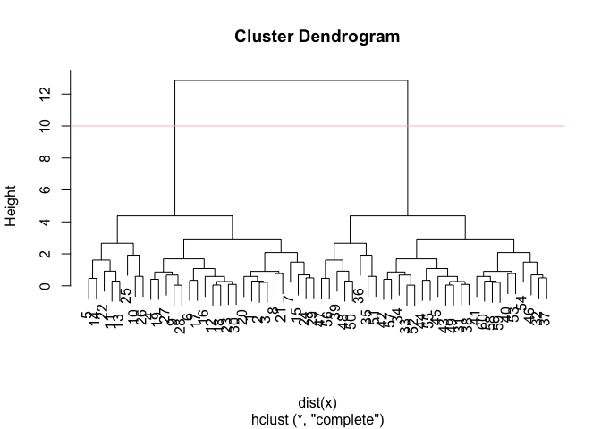

To get our results (i.e., memebership vector) we need to “cut” the tree.
The function for doing that is `cutree()`.

``` r
subgroups <- cutree(clustering, h = 10)
subgroups
```

     [1] 1 1 1 1 1 1 1 1 1 1 1 1 1 1 1 1 1 1 1 1 1 1 1 1 1 1 1 1 1 1 2 2 2 2 2 2 2 2
    [39] 2 2 2 2 2 2 2 2 2 2 2 2 2 2 2 2 2 2 2 2 2 2

Plotting this…

``` r
plot(x, col = subgroups)
```


You can also “cut” your tree with the number of clusters you want:

``` r
cutree(clustering, k = 2)
```

     [1] 1 1 1 1 1 1 1 1 1 1 1 1 1 1 1 1 1 1 1 1 1 1 1 1 1 1 1 1 1 1 2 2 2 2 2 2 2 2
    [39] 2 2 2 2 2 2 2 2 2 2 2 2 2 2 2 2 2 2 2 2 2 2

# Principal Component Analysis (PCA)

## PCA of the UK food

First was to read the data.

``` r
url <- "https://tinyurl.com/UK-foods"
x <- read.csv(url, row.names = 1)
head(x)
```

                   England Wales Scotland N.Ireland
    Cheese             105   103      103        66
    Carcass_meat       245   227      242       267
    Other_meat         685   803      750       586
    Fish               147   160      122        93
    Fats_and_oils      193   235      184       209
    Sugars             156   175      147       139

Now we can generate some basic visualizations

``` r
barplot( as.matrix(x), col = rainbow( nrow(x) ) )
```


Let’s refine our barplot:

``` r
barplot( as.matrix(x), col = rainbow( nrow(x) ), beside = T )
```


Other visualizations that can be useful…

``` r
pairs(x, col = rainbow( nrow(x) ), pch = 16)
```

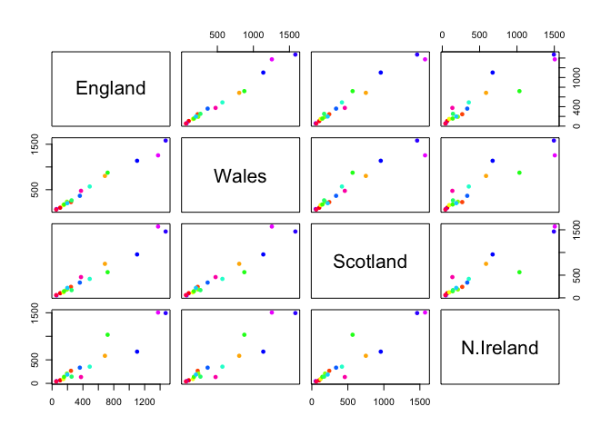

Let’s apply PCA (principal components analysis). For that, we need to
use the command `prcomp()`. This function expects the transpose of our
data.

``` r
# transpose_matrix <- t(x)
# pca <- prcomp( transpose_matrix )
pca <- prcomp( t(x) )
summary(pca)
```

    Importance of components:
                                PC1      PC2      PC3       PC4
    Standard deviation     324.1502 212.7478 73.87622 4.189e-14
    Proportion of Variance   0.6744   0.2905  0.03503 0.000e+00
    Cumulative Proportion    0.6744   0.9650  1.00000 1.000e+00

Let’s plot the PCA results

``` r
plot(pca)
```

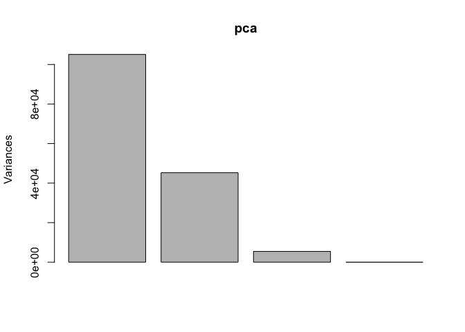

We need to access the results of the PCA analysis  

``` r
attributes(pca)
```

    $names
    [1] "sdev"     "rotation" "center"   "scale"    "x"       

    $class
    [1] "prcomp"

We can explore the pca\$x dataframe:

``` r
pca$x
```

                     PC1         PC2         PC3           PC4
    England   -144.99315    2.532999 -105.768945  2.842865e-14
    Wales     -240.52915  224.646925   56.475555  7.804382e-13
    Scotland   -91.86934 -286.081786   44.415495 -9.614462e-13
    N.Ireland  477.39164   58.901862    4.877895  1.448078e-13

Plotting:

``` r
plot( x=pca$x[,1], y=pca$x[,2] )
```

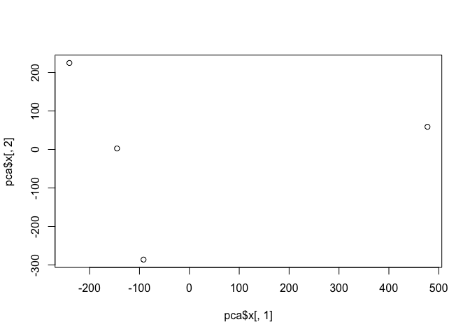

``` r
plot( x=pca$x[,1], y=pca$x[,2] )
colors_countries <- c('orange', 'pink', 'blue', 'green')
text( x=pca$x[,1], y=pca$x[,2], colnames(x), col = colors_countries)
```

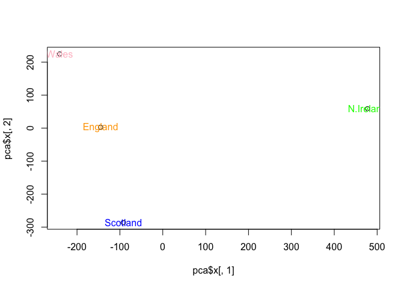

``` r
pca$scale
```

    [1] FALSE

## PCA of a RNA-Seq dataset

FIrst step as always is loading the data:

``` r
url2 <- "https://tinyurl.com/expression-CSV"
rna.data <- read.csv(url2, row.names=1)
```

**Q10**: How many genes and samples are in this data set?

``` r
dim(rna.data)
```

    [1] 100  10

I have 100 genes, and 10 samples.

Let’s apply PCA:

``` r
pca_rna = prcomp( t(rna.data) )
summary(pca_rna)
```

    Importance of components:
                                 PC1     PC2      PC3      PC4      PC5      PC6
    Standard deviation     2214.2633 88.9209 84.33908 77.74094 69.66341 67.78516
    Proportion of Variance    0.9917  0.0016  0.00144  0.00122  0.00098  0.00093
    Cumulative Proportion     0.9917  0.9933  0.99471  0.99593  0.99691  0.99784
                                PC7      PC8      PC9      PC10
    Standard deviation     65.29428 59.90981 53.20803 3.142e-13
    Proportion of Variance  0.00086  0.00073  0.00057 0.000e+00
    Cumulative Proportion   0.99870  0.99943  1.00000 1.000e+00

Let’s plot the principal components 1 and 2.

``` r
plot( pca_rna$x[,1], pca_rna$x[,2],
      xlab = 'PC1', ylab = 'PC2')
```

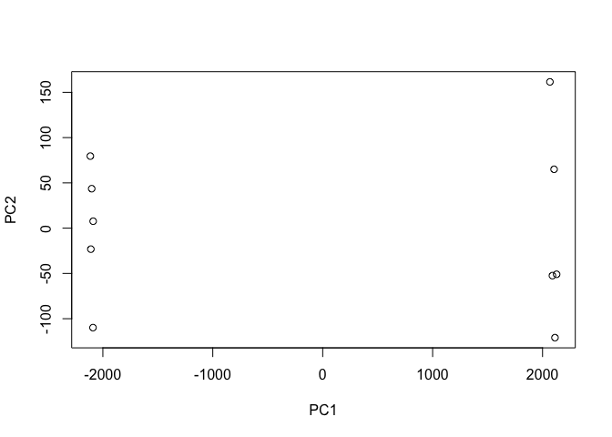

``` r
cols_samples <- c( rep('blue', 5), rep('red', 5) )
cols_samples
```

     [1] "blue" "blue" "blue" "blue" "blue" "red"  "red"  "red"  "red"  "red" 

``` r
plot( pca_rna$x[,1], pca_rna$x[,2],
      xlab = 'PC1', ylab = 'PC2', 
      col = cols_samples)
```

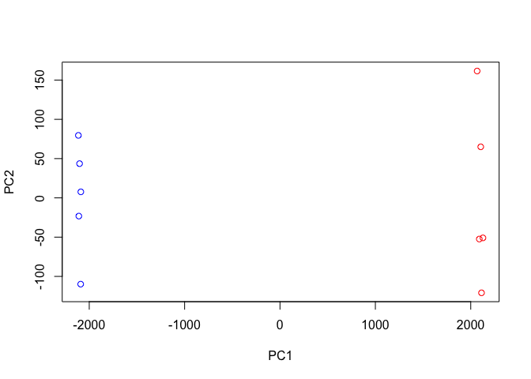

``` r
barplot(pca_rna$rotation[,1])
```

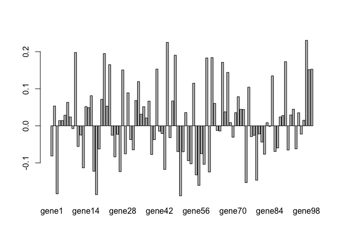

``` r
sort(pca_rna$rotation[,1])
```

          gene50       gene18        gene3       gene57       gene75       gene79 
    -0.188796985 -0.185668500 -0.183374164 -0.160771014 -0.153164404 -0.146803635 
          gene56       gene61       gene27       gene17       gene44       gene13 
    -0.132330117 -0.124572881 -0.123615228 -0.122536548 -0.117808971 -0.113357525 
          gene59       gene54       gene53       gene25        gene1       gene39 
    -0.103935563 -0.102503320 -0.093979884 -0.083761992 -0.081247810 -0.077306742 
          gene82       gene29       gene58       gene51       gene49       gene86 
    -0.076658760 -0.075605635 -0.075274651 -0.069855142 -0.069530208 -0.069165267 
          gene91       gene32       gene19       gene94       gene87       gene11 
    -0.065288752 -0.064721235 -0.062411218 -0.061938300 -0.059547317 -0.055698801 
          gene81       gene40       gene31       gene46       gene70       gene77 
    -0.043780416 -0.037323670 -0.037219970 -0.031990529 -0.030784982 -0.029225446 
          gene78       gene24       gene12       gene26       gene96       gene80 
    -0.025639741 -0.025407507 -0.024870802 -0.022868107 -0.022293151 -0.021824860 
          gene43       gene42       gene65       gene64        gene9       gene84 
    -0.020617052 -0.014550791 -0.014052839 -0.012639567 -0.007495075 -0.001289937 
          gene83       gene69        gene4        gene5       gene97       gene37 
     0.008504287  0.008871890  0.014242602  0.014303808  0.014994546  0.021280555 
          gene88        gene8       gene89        gene6       gene92       gene35 
     0.024015925  0.024026657  0.027652967  0.028634131  0.029394259  0.031349942 
          gene95       gene71       gene52       gene67       gene74       gene73 
     0.035342407  0.035589259  0.035802086  0.037840851  0.044286948  0.044581700 
          gene93       gene15       gene36       gene14       gene22        gene2 
     0.044940861  0.049090676  0.051765605  0.052004194  0.053013523  0.053465569 
          gene63        gene7       gene38       gene47       gene33       gene20 
     0.060529157  0.063389255  0.066665407  0.067141911  0.068437703  0.071571203 
          gene72       gene16       gene30       gene76       gene55       gene34 
     0.078551648  0.081254592  0.089150461  0.104435777  0.114988217  0.119604059 
          gene85       gene68       gene28       gene99      gene100       gene41 
     0.134907896  0.144227333  0.150812015  0.151678253  0.152877246  0.153077075 
          gene23       gene66       gene90       gene60       gene62       gene48 
     0.165155192  0.171311307  0.173156806  0.183139926  0.184203008  0.190495289 
          gene21       gene10       gene45       gene98 
     0.194884023  0.197905454  0.225149201  0.230633225 
