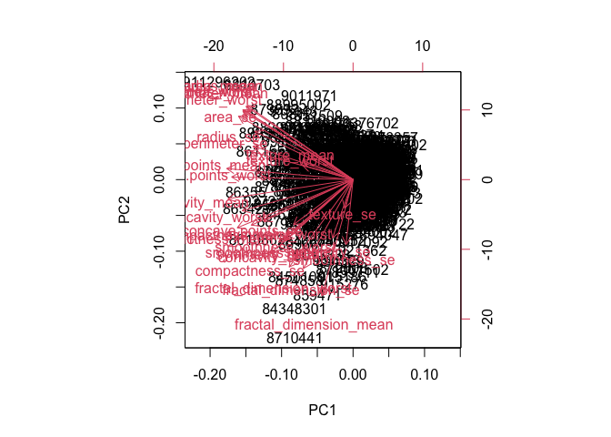
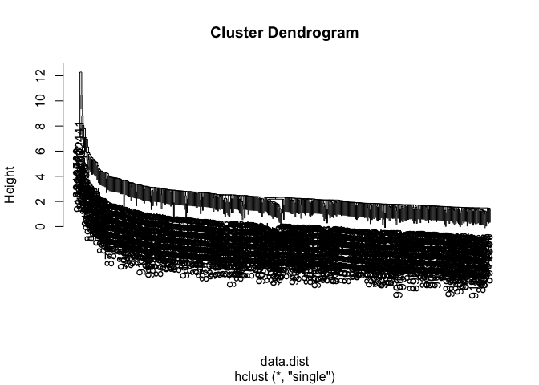
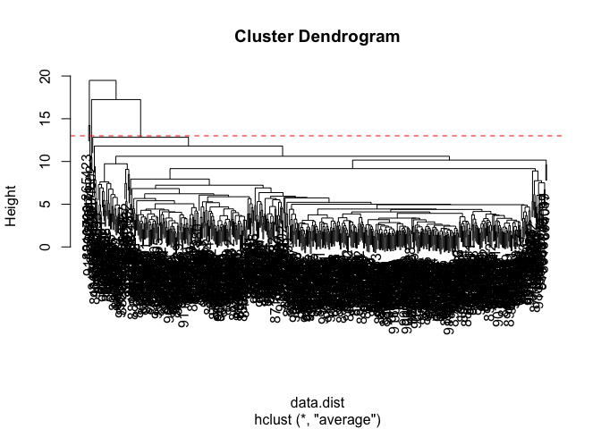
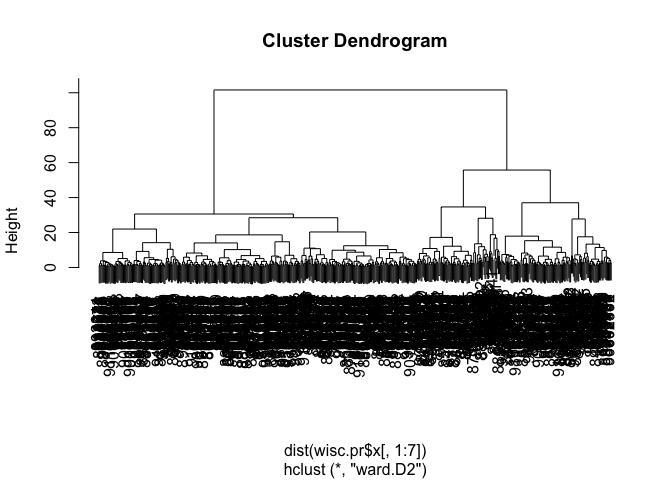
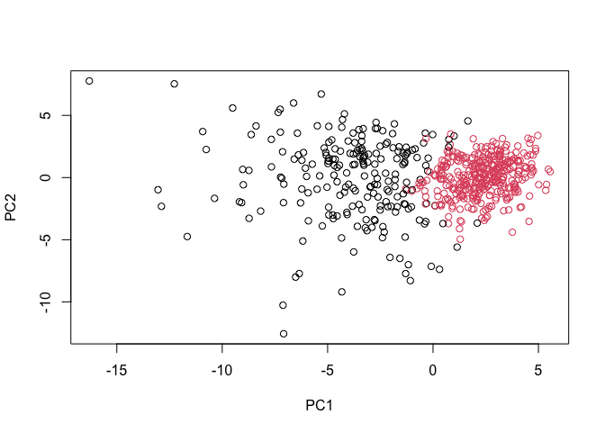
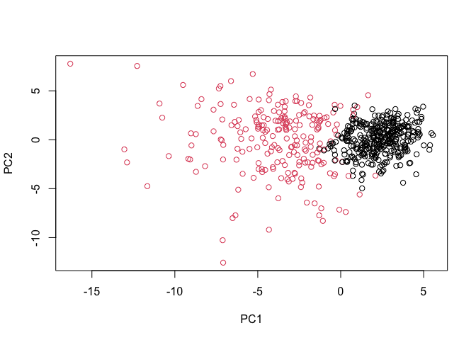
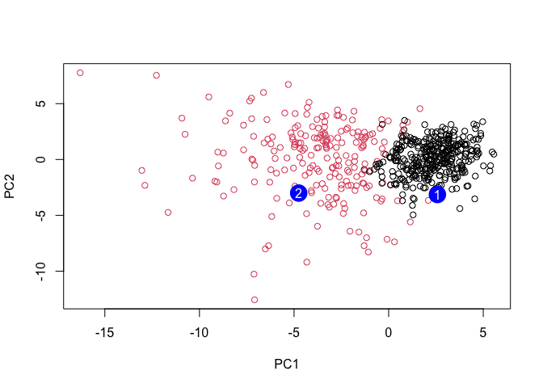

Class 8: Mini Project
================
Nicole Chang
4/28/23

# 1. Exploratory Data Analysis

## Prepare the Data

First we need to input and read the data.

``` r
# Save input data file into the Project directory
wisc.df <- read.csv('WisconsinCancer.csv', row.names = 1)
head(wisc.df)
```

             diagnosis radius_mean texture_mean perimeter_mean area_mean
    842302           M       17.99        10.38         122.80    1001.0
    842517           M       20.57        17.77         132.90    1326.0
    84300903         M       19.69        21.25         130.00    1203.0
    84348301         M       11.42        20.38          77.58     386.1
    84358402         M       20.29        14.34         135.10    1297.0
    843786           M       12.45        15.70          82.57     477.1
             smoothness_mean compactness_mean concavity_mean concave.points_mean
    842302           0.11840          0.27760         0.3001             0.14710
    842517           0.08474          0.07864         0.0869             0.07017
    84300903         0.10960          0.15990         0.1974             0.12790
    84348301         0.14250          0.28390         0.2414             0.10520
    84358402         0.10030          0.13280         0.1980             0.10430
    843786           0.12780          0.17000         0.1578             0.08089
             symmetry_mean fractal_dimension_mean radius_se texture_se perimeter_se
    842302          0.2419                0.07871    1.0950     0.9053        8.589
    842517          0.1812                0.05667    0.5435     0.7339        3.398
    84300903        0.2069                0.05999    0.7456     0.7869        4.585
    84348301        0.2597                0.09744    0.4956     1.1560        3.445
    84358402        0.1809                0.05883    0.7572     0.7813        5.438
    843786          0.2087                0.07613    0.3345     0.8902        2.217
             area_se smoothness_se compactness_se concavity_se concave.points_se
    842302    153.40      0.006399        0.04904      0.05373           0.01587
    842517     74.08      0.005225        0.01308      0.01860           0.01340
    84300903   94.03      0.006150        0.04006      0.03832           0.02058
    84348301   27.23      0.009110        0.07458      0.05661           0.01867
    84358402   94.44      0.011490        0.02461      0.05688           0.01885
    843786     27.19      0.007510        0.03345      0.03672           0.01137
             symmetry_se fractal_dimension_se radius_worst texture_worst
    842302       0.03003             0.006193        25.38         17.33
    842517       0.01389             0.003532        24.99         23.41
    84300903     0.02250             0.004571        23.57         25.53
    84348301     0.05963             0.009208        14.91         26.50
    84358402     0.01756             0.005115        22.54         16.67
    843786       0.02165             0.005082        15.47         23.75
             perimeter_worst area_worst smoothness_worst compactness_worst
    842302            184.60     2019.0           0.1622            0.6656
    842517            158.80     1956.0           0.1238            0.1866
    84300903          152.50     1709.0           0.1444            0.4245
    84348301           98.87      567.7           0.2098            0.8663
    84358402          152.20     1575.0           0.1374            0.2050
    843786            103.40      741.6           0.1791            0.5249
             concavity_worst concave.points_worst symmetry_worst
    842302            0.7119               0.2654         0.4601
    842517            0.2416               0.1860         0.2750
    84300903          0.4504               0.2430         0.3613
    84348301          0.6869               0.2575         0.6638
    84358402          0.4000               0.1625         0.2364
    843786            0.5355               0.1741         0.3985
             fractal_dimension_worst
    842302                   0.11890
    842517                   0.08902
    84300903                 0.08758
    84348301                 0.17300
    84358402                 0.07678
    843786                   0.12440

To make sure we don’t accidentally include diagnosis in our analysis,
lets create a new data.frame that omits this first column.

``` r
# We can use -1 here to remove the first column
wisc.data <- wisc.df[ ,-1]
```

Create a diagnosis vector for later

``` r
diagnosis <- wisc.df$diagnosis 
```

## Exploratory Data Analysis

**Q1. How many observations are in this dataset?**

``` r
nrow(wisc.data)
```

    [1] 569

There are 569 observations.

**Q2. How many of the observations have a malignant diagnosis?**

``` r
table(wisc.df$diagnosis)
```


      B   M 
    357 212 

``` r
diagnosis <- wisc.df$diagnosis
```

There are 212 observations that have a malignant diagnosis.

**Q3. How many variables/features in the data are suffixed with
`_mean`?**

``` r
length(grep("_mean", colnames(wisc.df)))
```

    [1] 10

There are 10 variables/features in the data that are suffixed with
`_mean`.

# 2. Principal Component Analysis

## Performing PCA

The next step is to perform principal component analysis (PCA) on
`wisc.data`.

``` r
# Check column means and standard deviations
colMeans(wisc.data)
```

                radius_mean            texture_mean          perimeter_mean 
               1.412729e+01            1.928965e+01            9.196903e+01 
                  area_mean         smoothness_mean        compactness_mean 
               6.548891e+02            9.636028e-02            1.043410e-01 
             concavity_mean     concave.points_mean           symmetry_mean 
               8.879932e-02            4.891915e-02            1.811619e-01 
     fractal_dimension_mean               radius_se              texture_se 
               6.279761e-02            4.051721e-01            1.216853e+00 
               perimeter_se                 area_se           smoothness_se 
               2.866059e+00            4.033708e+01            7.040979e-03 
             compactness_se            concavity_se       concave.points_se 
               2.547814e-02            3.189372e-02            1.179614e-02 
                symmetry_se    fractal_dimension_se            radius_worst 
               2.054230e-02            3.794904e-03            1.626919e+01 
              texture_worst         perimeter_worst              area_worst 
               2.567722e+01            1.072612e+02            8.805831e+02 
           smoothness_worst       compactness_worst         concavity_worst 
               1.323686e-01            2.542650e-01            2.721885e-01 
       concave.points_worst          symmetry_worst fractal_dimension_worst 
               1.146062e-01            2.900756e-01            8.394582e-02 

``` r
apply(wisc.data,2,sd)
```

                radius_mean            texture_mean          perimeter_mean 
               3.524049e+00            4.301036e+00            2.429898e+01 
                  area_mean         smoothness_mean        compactness_mean 
               3.519141e+02            1.406413e-02            5.281276e-02 
             concavity_mean     concave.points_mean           symmetry_mean 
               7.971981e-02            3.880284e-02            2.741428e-02 
     fractal_dimension_mean               radius_se              texture_se 
               7.060363e-03            2.773127e-01            5.516484e-01 
               perimeter_se                 area_se           smoothness_se 
               2.021855e+00            4.549101e+01            3.002518e-03 
             compactness_se            concavity_se       concave.points_se 
               1.790818e-02            3.018606e-02            6.170285e-03 
                symmetry_se    fractal_dimension_se            radius_worst 
               8.266372e-03            2.646071e-03            4.833242e+00 
              texture_worst         perimeter_worst              area_worst 
               6.146258e+00            3.360254e+01            5.693570e+02 
           smoothness_worst       compactness_worst         concavity_worst 
               2.283243e-02            1.573365e-01            2.086243e-01 
       concave.points_worst          symmetry_worst fractal_dimension_worst 
               6.573234e-02            6.186747e-02            1.806127e-02 

Execute PCA with the `prcomp()` function on the `wisc.data`, scaling if
appropriate, and assign the output model to `wisc.pr`.

``` r
# Perform PCA on wisc.data by completing the following code
wisc.pr <- prcomp(wisc.data, scale. = TRUE)
```

Look at summary of results

``` r
summary(wisc.pr)
```

    Importance of components:
                              PC1    PC2     PC3     PC4     PC5     PC6     PC7
    Standard deviation     3.6444 2.3857 1.67867 1.40735 1.28403 1.09880 0.82172
    Proportion of Variance 0.4427 0.1897 0.09393 0.06602 0.05496 0.04025 0.02251
    Cumulative Proportion  0.4427 0.6324 0.72636 0.79239 0.84734 0.88759 0.91010
                               PC8    PC9    PC10   PC11    PC12    PC13    PC14
    Standard deviation     0.69037 0.6457 0.59219 0.5421 0.51104 0.49128 0.39624
    Proportion of Variance 0.01589 0.0139 0.01169 0.0098 0.00871 0.00805 0.00523
    Cumulative Proportion  0.92598 0.9399 0.95157 0.9614 0.97007 0.97812 0.98335
                              PC15    PC16    PC17    PC18    PC19    PC20   PC21
    Standard deviation     0.30681 0.28260 0.24372 0.22939 0.22244 0.17652 0.1731
    Proportion of Variance 0.00314 0.00266 0.00198 0.00175 0.00165 0.00104 0.0010
    Cumulative Proportion  0.98649 0.98915 0.99113 0.99288 0.99453 0.99557 0.9966
                              PC22    PC23   PC24    PC25    PC26    PC27    PC28
    Standard deviation     0.16565 0.15602 0.1344 0.12442 0.09043 0.08307 0.03987
    Proportion of Variance 0.00091 0.00081 0.0006 0.00052 0.00027 0.00023 0.00005
    Cumulative Proportion  0.99749 0.99830 0.9989 0.99942 0.99969 0.99992 0.99997
                              PC29    PC30
    Standard deviation     0.02736 0.01153
    Proportion of Variance 0.00002 0.00000
    Cumulative Proportion  1.00000 1.00000

**Q4. From your results, what proportion of the original variance is
captured by the first principal components (PC1)?**

0.4427

**Q5. How many principal components (PCs) are required to describe at
least 70% of the original variance in the data?**

``` r
variance <- (wisc.pr$sdev^2)
variance/(sum(variance))
```

     [1] 4.427203e-01 1.897118e-01 9.393163e-02 6.602135e-02 5.495768e-02
     [6] 4.024522e-02 2.250734e-02 1.588724e-02 1.389649e-02 1.168978e-02
    [11] 9.797190e-03 8.705379e-03 8.045250e-03 5.233657e-03 3.137832e-03
    [16] 2.662093e-03 1.979968e-03 1.753959e-03 1.649253e-03 1.038647e-03
    [21] 9.990965e-04 9.146468e-04 8.113613e-04 6.018336e-04 5.160424e-04
    [26] 2.725880e-04 2.300155e-04 5.297793e-05 2.496010e-05 4.434827e-06

Three principal components are required to describe at least 70% of the
original variance in the data.

**Q6. How many principal components (PCs) are required to describe at
least 90% of the original variance in the data?**

Seven principal components are required to describe at least 90% of the
original variance in the data.

## Interpreting PCA results

Now you will use some visualizations to better understand your PCA
model. A common visualization for PCA results is the so-called biplot.

**Q7. What stands out to you about this plot? Is it easy or difficult to
understand? Why?**

This plot is very messy and difficult to understand because the rownames
are used as the plotting character, making it cluttered.

``` r
biplot(wisc.pr)
```



Create a cleaner plot

``` r
diagnosis <- as.factor(diagnosis)
```

``` r
plot( wisc.pr$x[, 1:2], col = diagnosis , 
     xlab = "PC1", ylab = "PC2")
```


**Q8. Generate a similar plot for principal components 1 and 3. What do
you notice about these plots?**

``` r
plot(wisc.pr$x[, 1], wisc.pr$x[, 3], col = diagnosis, 
     xlab = "PC1", ylab = "PC3")
```


Based on the two plots, we can tell that the distinguishing factor for
the diagnosis is reliant on PC1.

Create a data.frame for ggplot

``` r
df <- as.data.frame(wisc.pr$x)
df$diagnosis <- diagnosis
```

Load the ggplot2 package

``` r
library(ggplot2)
```

Make a scatter plot colored by diagnosis

``` r
ggplot(df) + 
  aes(PC1, PC2, col= diagnosis) + 
  geom_point()
```


## Variance explained

We will produce scree plots showing the proportion of variance explained
as the number of principal components increase.

Calculate variance of each component

``` r
pr.var <- wisc.pr$sdev^2
head(pr.var)
```

    [1] 13.281608  5.691355  2.817949  1.980640  1.648731  1.207357

Calculate the variance explained by each principal component by dividing
by the total variance explained of all principal components.

``` r
# Variance explained by each principal component: pve
pve <- pr.var / sum(pr.var)
```

``` r
# Plot variance explained for each principal component
plot(pve, xlab = "Principal Component", 
     ylab = "Proportion of Variance Explained", 
     ylim = c(0, 1), type = "o")
```


``` r
# Alternative scree plot of the same data, note data driven y-axis
barplot(pve, ylab = "Precent of Variance Explained",
     names.arg=paste0("PC",1:length(pve)), las=2, axes = FALSE)
axis(2, at=pve, labels=round(pve,2)*100 )
```


ggplot based graph

Install the package

``` r
#install.packages("factoextra")
```

Now plot

``` r
library(factoextra)
```

    Welcome! Want to learn more? See two factoextra-related books at https://goo.gl/ve3WBa

``` r
fviz_eig(wisc.pr, addlabels = TRUE)
```


## Communicating PCA results

**Q9. For the first principal component, what is the component of the
loading vector (i.e. `wisc.pr$rotation[,1]`) for the feature
`concave.points_mean`? This tells us how much this original feature
contributes to the first PC.**

``` r
View(wisc.pr$rotation[,1])
```

-0.2608538

# 3. Hierarchical clustering

Scale the wisc.data using the `scale()` function

``` r
data.scaled <- scale(wisc.data)
```

Calculate the (Euclidean) distances between all pairs of observations in
the new scaled dataset and assign the result to `data.dist`.

``` r
data.dist <- dist(data.scaled)
```

Create a hierarchical clustering model using complete linkage.

``` r
wisc.hclust <- hclust(data.dist, method = "complete")
```

## Results of hierarchical clustering

**Q10. Using the `plot()` and `abline()` functions, what is the height
at which the clustering model has 4 clusters?**

``` r
plot(wisc.hclust)
abline(h=19, col="red", lty=2)
```


The height at which the clustering model has 4 clusters is 19.

``` r
wisc.hclust.clusters <- cutree(wisc.hclust, k = 4)
table(wisc.hclust.clusters, diagnosis)
```

                        diagnosis
    wisc.hclust.clusters   B   M
                       1  12 165
                       2   2   5
                       3 343  40
                       4   0   2

## Using different methods

**Q12. Which method gives your favorite results for the same `data.dist`
dataset? Explain your reasoning.**

Ward.D2 is the method that gives my favorite results for the dataset
because it is a lot easier to see the clusters and it minimizes the
variance within the clusters.

``` r
wisc.hclust.single <- hclust(data.dist, method = "single")
plot(wisc.hclust.single)
```



``` r
wisc.hclust.avg <- hclust(data.dist, method = "average")
plot(wisc.hclust.avg)
abline(h=13, col="red", lty=2)
```



``` r
wisc.hclust.ward <- hclust(data.dist, method = "ward.D2")
plot(wisc.hclust.ward)
```


# 4. Combining methods

## Clustering on PCA results

Let’s see if PCA improves or degrades the performance of hierarchical
clustering.

``` r
wisc.pr.hclust <- hclust(dist(wisc.pr$x[, 1:7]), method="ward.D2")
plot(wisc.pr.hclust)
```



``` r
grps <- cutree(wisc.pr.hclust, k=2)
table(grps)
```

    grps
      1   2 
    216 353 

``` r
table(grps, diagnosis)
```

        diagnosis
    grps   B   M
       1  28 188
       2 329  24

``` r
plot(wisc.pr$x[,1:2], col=grps)
```



``` r
plot(wisc.pr$x[,1:2], col=diagnosis)
```


``` r
g <- as.factor(grps)
levels(g)
```

    [1] "1" "2"

``` r
g <- relevel(g,2)
levels(g)
```

    [1] "2" "1"

Plot using our re-ordered factor:

``` r
plot(wisc.pr$x[,1:2], col=g)
```



Cut this hierarchical clustering model into 2 clusters and assign the
results to `wisc.pr.hclust.clusters`.

``` r
wisc.pr.hclust.clusters <- cutree(wisc.pr.hclust, k=2)
```

**Q13. How well does the newly created model with four clusters separate
out the two diagnoses?**

``` r
# Compare to actual diagnoses
table(wisc.pr.hclust.clusters, diagnosis)
```

                           diagnosis
    wisc.pr.hclust.clusters   B   M
                          1  28 188
                          2 329  24

The newly created model with four clusters separates out the two
diagnoses pretty well.

**Q14. How well do the hierarchical clustering models you created in
previous sections (i.e. before PCA) do in terms of separating the
diagnoses? Again, use the `table()` function to compare the output of
each model (`wisc.km$cluster` and `wisc.hclust.clusters`) with the
vector containing the actual diagnoses.**

``` r
table(wisc.hclust.clusters, diagnosis)
```

                        diagnosis
    wisc.hclust.clusters   B   M
                       1  12 165
                       2   2   5
                       3 343  40
                       4   0   2

The hierarchical clustering models I created in previous sections do not
do as well of a job separating the diagnoses as the new model does, but
it still distinguishes the diagnoses.

# 6. Prediction

We will use the `predict()` function that will take our PCA model from
before and new cancer cell data and project that data onto our PCA
space.

``` r
#url <- "new_samples.csv"
url <- "https://tinyurl.com/new-samples-CSV"
new <- read.csv(url)
npc <- predict(wisc.pr, newdata=new)
npc
```

               PC1       PC2        PC3        PC4       PC5        PC6        PC7
    [1,]  2.576616 -3.135913  1.3990492 -0.7631950  2.781648 -0.8150185 -0.3959098
    [2,] -4.754928 -3.009033 -0.1660946 -0.6052952 -1.140698 -1.2189945  0.8193031
                PC8       PC9       PC10      PC11      PC12      PC13     PC14
    [1,] -0.2307350 0.1029569 -0.9272861 0.3411457  0.375921 0.1610764 1.187882
    [2,] -0.3307423 0.5281896 -0.4855301 0.7173233 -1.185917 0.5893856 0.303029
              PC15       PC16        PC17        PC18        PC19       PC20
    [1,] 0.3216974 -0.1743616 -0.07875393 -0.11207028 -0.08802955 -0.2495216
    [2,] 0.1299153  0.1448061 -0.40509706  0.06565549  0.25591230 -0.4289500
               PC21       PC22       PC23       PC24        PC25         PC26
    [1,]  0.1228233 0.09358453 0.08347651  0.1223396  0.02124121  0.078884581
    [2,] -0.1224776 0.01732146 0.06316631 -0.2338618 -0.20755948 -0.009833238
                 PC27        PC28         PC29         PC30
    [1,]  0.220199544 -0.02946023 -0.015620933  0.005269029
    [2,] -0.001134152  0.09638361  0.002795349 -0.019015820

``` r
plot(wisc.pr$x[,1:2], col=g)
points(npc[,1], npc[,2], col="blue", pch=16, cex=3)
text(npc[,1], npc[,2], c(1,2), col="white")
```



**Q16. Which of these new patients should we prioritize for follow up
based on your results?**

Based on my results, we should prioritize patient 2.
