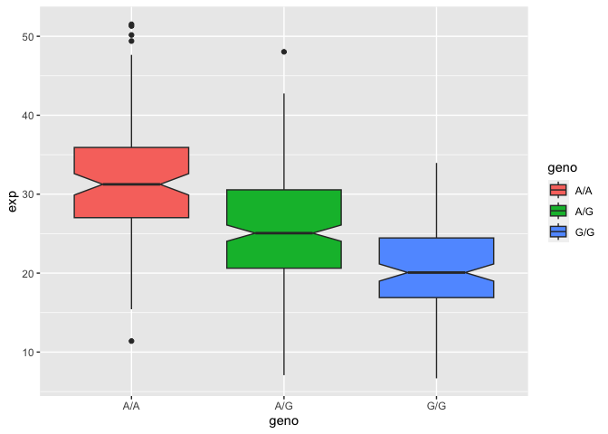

Section 4: Population Scale Analysis
================
Nicole Chang
5/16/23

## Q13. Read this file into R and determine the sample size for each genotype and their

corresponding median expression levels for each of these genotypes.

Reading file:

``` r
experiment <- read.table("https://bioboot.github.io/bggn213_W19/class-material/rs8067378_ENSG00000172057.6.txt")
View(experiment)
```

Determine sample size:

``` r
nrow(experiment)
```

    [1] 462

Looking at each genotype:

``` r
table(experiment$geno)
```


    A/A A/G G/G 
    108 233 121 

Separating each genotype:

``` r
AA <- experiment[experiment[,"geno"]=="A/A",]
AG <- experiment[experiment[,"geno"]=="A/G",]
GG <- experiment[experiment[,"geno"]=="G/G",]
```

Median expression level for A/A genotype:

``` r
median(AA$exp)
```

    [1] 31.24847

Median expression level for A/G genotype:

``` r
median(AG$exp)
```

    [1] 25.06486

Median expression level for G/G genotype:

``` r
median(GG$exp)
```

    [1] 20.07363

## Q14. Generate a boxplot with a box per genotype, what could you infer from the relative expression value between A/A and G/G displayed in this plot? Does the SNP effect the expression of ORMDL3?

Load ggplot2

``` r
library(ggplot2)
```

Create boxplot

``` r
ggplot(experiment) + aes(geno, exp, fill=geno) +
  geom_boxplot(notch=TRUE)
```



Based on the plot, the relative expression of G/G shows a significant
reduction compared to the relative expression of A/A in this gene. The
SNP seems to affect the expression of ORMDL3.
