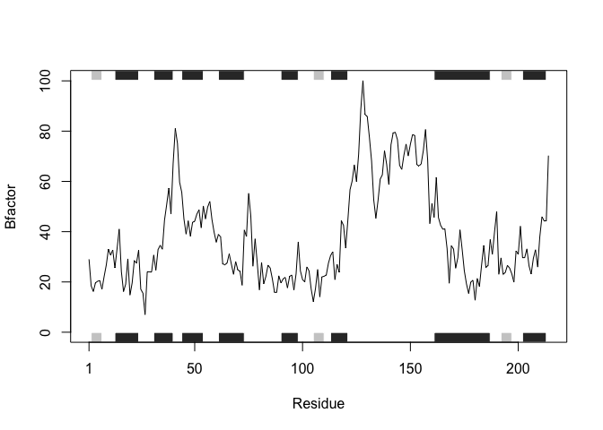
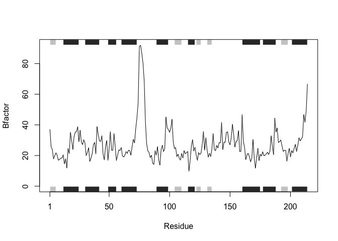
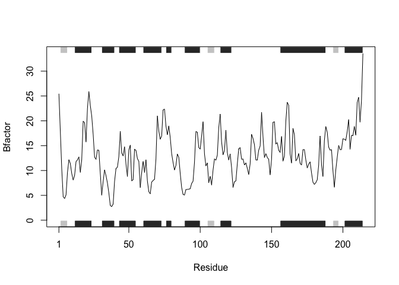

Lecture 06 HW
================
Nicole Chang
4/24/23

In this homework we write our own function that analyzes protein drug
interactions by reading in any protein PDB data and outputs a plot for
the specified protein.

We will start with the code given.

# Homework

First we install the package:

``` r
#install.packages("bio3d")
```

Then we will access the data and label them:

``` r
library(bio3d)
s1 <- read.pdb("4AKE") # kinase with drug
```

      Note: Accessing on-line PDB file

``` r
s2 <- read.pdb("1AKE") # kinase no drug
```

      Note: Accessing on-line PDB file
       PDB has ALT records, taking A only, rm.alt=TRUE

``` r
s3 <- read.pdb("1E4Y") # kinase with drug
```

      Note: Accessing on-line PDB file

Then we will trim the PDB object to a subset of atoms:

``` r
s1.chainA <- trim.pdb(s1, chain="A", elety="CA")
s2.chainA <- trim.pdb(s2, chain="A", elety="CA")
s3.chainA <- trim.pdb(s3, chain="A", elety="CA")
```

Then we will isolate the atoms from each kinase:

``` r
s1.b <- s1.chainA$atom$b
s2.b <- s2.chainA$atom$b
s3.b <- s3.chainA$atom$b
```

Then we will plot:

``` r
plotb3(s1.b, sse=s1.chainA, typ="l", ylab="Bfactor")
```



``` r
plotb3(s2.b, sse=s2.chainA, typ="l", ylab="Bfactor")
```



``` r
plotb3(s3.b, sse=s3.chainA, typ="l", ylab="Bfactor")
```



# Q6. How would you generalize the original code above to work with any set of input

protein structures?

Now we will create a function that can be used for any set of input
protein structures:

``` r
myfunction <- function(PDB_ID){
  # Access the data and label
  library(bio3d)
  PDB <- read.pdb(PDB_ID)
  # Trim the PDB object to a subset of atoms
  PDB.chainA <- trim.pdb(PDB, chain="A", elety="CA")
  # Isolate the atoms from the kinase
  PDB.b <- PDB.chainA$atom$b
  # Plot
  plotb3(PDB.b, sse=PDB.chainA, typ="l", ylab="Bfactor")
}
```

Then we will test the function:

``` r
myfunction("4AKE")
```

      Note: Accessing on-line PDB file

    Warning in get.pdb(file, path = tempdir(), verbose = FALSE):
    /var/folders/kw/hhwv0wcs7ndgg1wsmwjp8m_80000gn/T//Rtmp8nAokz/4AKE.pdb exists.
    Skipping download


``` r
myfunction("1AKE")
```

      Note: Accessing on-line PDB file

    Warning in get.pdb(file, path = tempdir(), verbose = FALSE):
    /var/folders/kw/hhwv0wcs7ndgg1wsmwjp8m_80000gn/T//Rtmp8nAokz/1AKE.pdb exists.
    Skipping download

       PDB has ALT records, taking A only, rm.alt=TRUE


``` r
myfunction("1E4Y")
```

      Note: Accessing on-line PDB file

    Warning in get.pdb(file, path = tempdir(), verbose = FALSE):
    /var/folders/kw/hhwv0wcs7ndgg1wsmwjp8m_80000gn/T//Rtmp8nAokz/1E4Y.pdb exists.
    Skipping download


This function is used to analyze protein drug interactions by reading in
any protein PDB data and outputs a plot for the specified protein.
