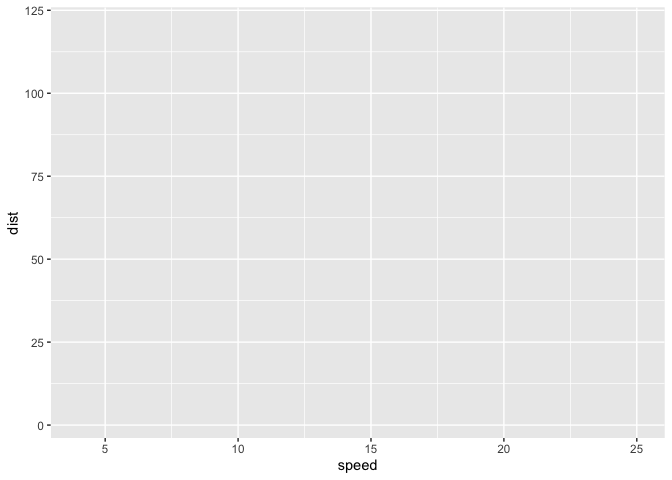
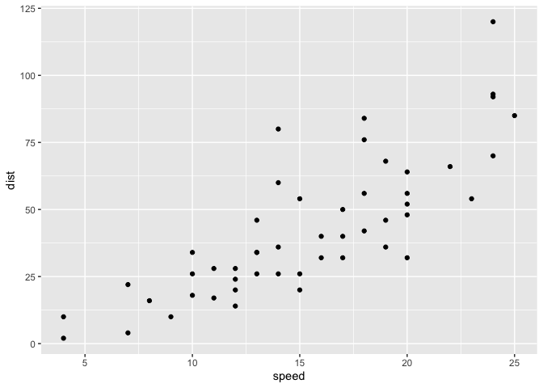
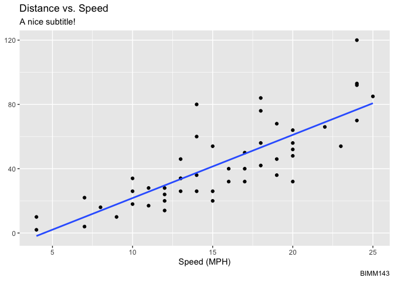
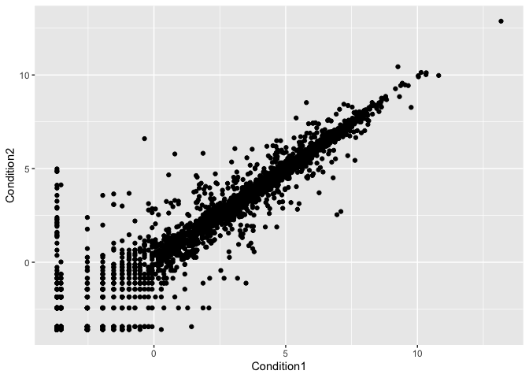
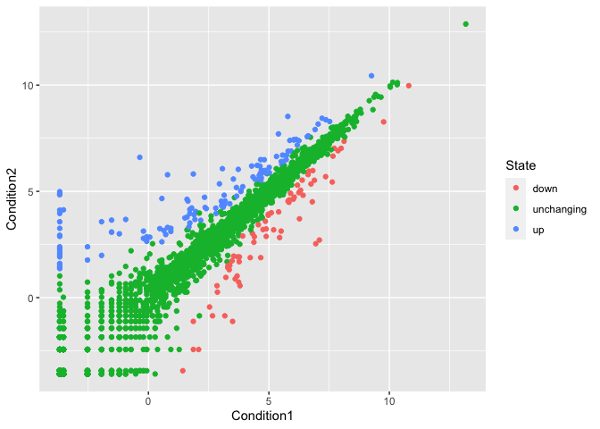
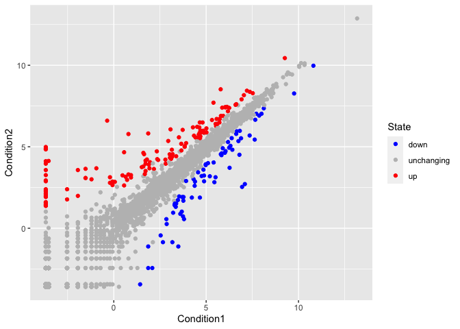
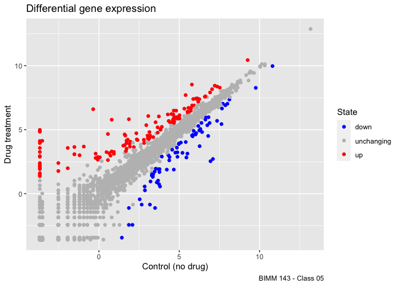

Class 05: Data Visualization with GGPLOT
================
nicole chang
4/19/23

**Q1.** For which phases is data visualization important in our
scientific workflows?

For Exploratory data analysis, detection of outliers, and Communication
of results.

**Q2.** True or False? The ggplot2 package comes already installed with
R?

FALSE

**Q.** Which plot types are typically NOT used to compare distributions
of numeric variables?

Network graphs

**Q.** Which statement about data visualization with ggplot2 is
incorrect?

ggplot2 is the only way to create plots in R

# Base R plotting

We are going to start by generating the plot of class 04. This code is
plotting the **cars** `dataset`.

``` r
plot(cars)
```


# Ggplot2

First, we need to install the package. We do this by using the
`install.packages` command.

``` r
# install.packages('ggplot2')
```

After that, we need to load the package.

``` r
library(ggplot2)
```

**Q.** Which geometric layer should be used to create scatter plots in
ggplot2?

geom_point()

We are going to build the plot of the cars dataframe by using ggplot2.

``` r
ggplot(data = cars)
```


``` r
ggplot(data = cars) + 
  aes(x=speed, y=dist)
```



``` r
ggplot(data = cars) + 
  aes(x=speed, y=dist) + 
  geom_point()
```



``` r
ggplot(data = cars) + 
  aes(x=speed, y=dist) + 
  geom_point() +
  geom_smooth(method = 'lm', se=FALSE) + 
  labs(title = 'Distance vs. Speed', 
       subtitle = 'A nice subtitle!', 
       caption = 'BIMM143',
       x = 'Speed (MPH)',
       y = 'Distance (feet)' + theme_bw())
```

    `geom_smooth()` using formula = 'y ~ x'



# Plotting gene expression data

Loading the data from the URL.

``` r
url <- "https://bioboot.github.io/bimm143_S20/class-material/up_down_expression.txt"
genes <- read.delim(url)
head(genes)
```

            Gene Condition1 Condition2      State
    1      A4GNT -3.6808610 -3.4401355 unchanging
    2       AAAS  4.5479580  4.3864126 unchanging
    3      AASDH  3.7190695  3.4787276 unchanging
    4       AATF  5.0784720  5.0151916 unchanging
    5       AATK  0.4711421  0.5598642 unchanging
    6 AB015752.4 -3.6808610 -3.5921390 unchanging

Initial ggplot

``` r
ggplot(data = genes) +
  aes(x=Condition1, y=Condition2) +
  geom_point()
```



Q3

``` r
nrow(genes)
```

    [1] 5196

``` r
ncol(genes)
```

    [1] 4

``` r
colnames(genes)
```

    [1] "Gene"       "Condition1" "Condition2" "State"     

``` r
table(genes[,'State'])
```


          down unchanging         up 
            72       4997        127 

**Q.** Use the `nrow()` function to find out how many genes are in this
dataset. What is your answer?

5196

**Q.** Use the `colnames()` function and the `ncol()` function on the
`genes` data frame to find out what the column names are (we will need
these later) and how many columns there are. How many columns did you
find?

4

**Q.** Use the `table()` function on the `State` column of this
data.frame to find out how many ‘up’ regulated genes there are. What is
your answer?

127

**Q.** Using your values above and 2 significant figures. What fraction
of total genes is up-regulated in this dataset?

2.44

**Adding color to the plot**

``` r
p1 <- ggplot(data = genes) +
  aes(x=Condition1, y=Condition2, col=State) +
  geom_point()
p1
```



Let’s change the color scheme.

``` r
p2 <- p1 +
  scale_color_manual(values = c("blue", "gray", "red"))
p2
```



Let’s add some labels

``` r
p2 + labs(title = 'Differential gene expression',
          x = 'Control (no drug)',
          y = 'Drug treatment',
          caption = 'BIMM 143 - Class 05')
```


