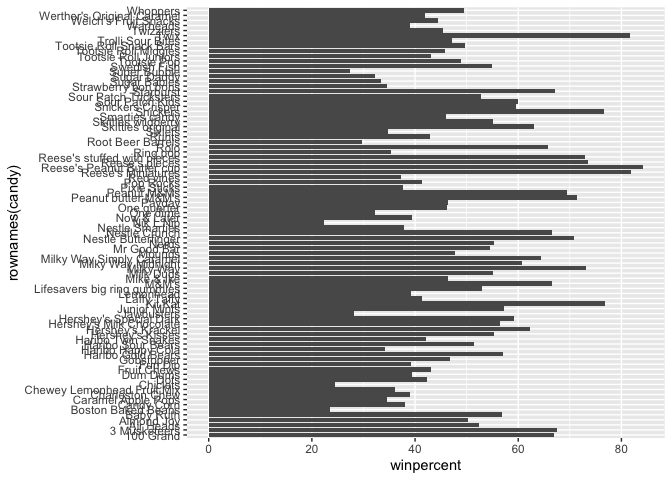
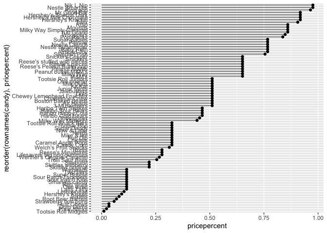
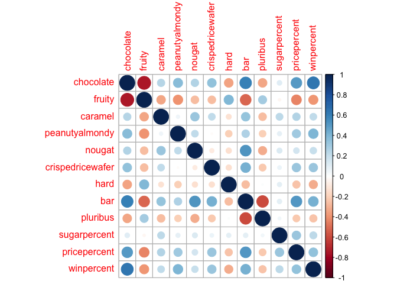

Class 10: Halloween Candy
================
Nicole Chang
5/5/23

# 1. Importing candy data

``` r
candy = read.csv('https://raw.githubusercontent.com/fivethirtyeight/data/master/candy-power-ranking/candy-data.csv', row.names = 1)
View(candy)
```

Q1. How many different candy types are in this dataset?

``` r
candy_types <- nrow(candy)
```

Q2. How many fruity candy types are in the dataset?

``` r
fruity_candy_types <- sum(candy$fruity)
fruity_candy_types
```

    [1] 38

# 2. What’s your favorite candy?

Q3. What is your favorite candy in the dataset and what is it's
`winpercent` value?

``` r
candy["Twizzlers", 'winpercent']
```

    [1] 45.46628

Q4. What is the `winpercent` value for "Kit Kat"?

``` r
candy["Kit Kat", ]$winpercent
```

    [1] 76.7686

Q5. What is the `winpercent` value for "Tootsie Roll Snack Bars"?

``` r
candy["Tootsie Roll Snack Bars", ]$winpercent
```

    [1] 49.6535

``` r
# install.packages('skimr')
library(skimr)
skim(candy)
```

|                                                  |       |
|:-------------------------------------------------|:------|
| Name                                             | candy |
| Number of rows                                   | 85    |
| Number of columns                                | 12    |
| \_\_\_\_\_\_\_\_\_\_\_\_\_\_\_\_\_\_\_\_\_\_\_   |       |
| Column type frequency:                           |       |
| numeric                                          | 12    |
| \_\_\_\_\_\_\_\_\_\_\_\_\_\_\_\_\_\_\_\_\_\_\_\_ |       |
| Group variables                                  | None  |

Data summary

**Variable type: numeric**

| skim_variable    | n_missing | complete_rate |  mean |    sd |    p0 |   p25 |   p50 |   p75 |  p100 | hist  |
|:-----------------|----------:|--------------:|------:|------:|------:|------:|------:|------:|------:|:------|
| chocolate        |         0 |             1 |  0.44 |  0.50 |  0.00 |  0.00 |  0.00 |  1.00 |  1.00 | ▇▁▁▁▆ |
| fruity           |         0 |             1 |  0.45 |  0.50 |  0.00 |  0.00 |  0.00 |  1.00 |  1.00 | ▇▁▁▁▆ |
| caramel          |         0 |             1 |  0.16 |  0.37 |  0.00 |  0.00 |  0.00 |  0.00 |  1.00 | ▇▁▁▁▂ |
| peanutyalmondy   |         0 |             1 |  0.16 |  0.37 |  0.00 |  0.00 |  0.00 |  0.00 |  1.00 | ▇▁▁▁▂ |
| nougat           |         0 |             1 |  0.08 |  0.28 |  0.00 |  0.00 |  0.00 |  0.00 |  1.00 | ▇▁▁▁▁ |
| crispedricewafer |         0 |             1 |  0.08 |  0.28 |  0.00 |  0.00 |  0.00 |  0.00 |  1.00 | ▇▁▁▁▁ |
| hard             |         0 |             1 |  0.18 |  0.38 |  0.00 |  0.00 |  0.00 |  0.00 |  1.00 | ▇▁▁▁▂ |
| bar              |         0 |             1 |  0.25 |  0.43 |  0.00 |  0.00 |  0.00 |  0.00 |  1.00 | ▇▁▁▁▂ |
| pluribus         |         0 |             1 |  0.52 |  0.50 |  0.00 |  0.00 |  1.00 |  1.00 |  1.00 | ▇▁▁▁▇ |
| sugarpercent     |         0 |             1 |  0.48 |  0.28 |  0.01 |  0.22 |  0.47 |  0.73 |  0.99 | ▇▇▇▇▆ |
| pricepercent     |         0 |             1 |  0.47 |  0.29 |  0.01 |  0.26 |  0.47 |  0.65 |  0.98 | ▇▇▇▇▆ |
| winpercent       |         0 |             1 | 50.32 | 14.71 | 22.45 | 39.14 | 47.83 | 59.86 | 84.18 | ▃▇▆▅▂ |

Q6. Is there any variable/column that looks to be on a different scale
to the majority of the other columns in the dataset?

In the dataset the sugarpercent, the pricepercent, and the winpercent
variables are on a different scale in comparison to majority of the
other columns.

Q7. What do you think a zero and one represent for the `candy$chocolate`
column?

The zeros and the ones represent whether the candy is considered
chocolate or not.

Q8. Plot a histogram of `winpercent` values

``` r
hist(candy$winpercent)
```


Q9. Is the distribution of `winpercent` values symmetrical?

The distribution is not symmetrical and skewed to the right.

Q10. Is the center of the distribution above or below 50%?

The distribution is below 50%.

We want to compare chocolate and fruity candy

``` r
# chocolate_candy = candy$winpercent [as.logical(candy$chocolate) ]

table(as.logical(candy$chocolate))
```


    FALSE  TRUE 
       48    37 

Q11. On average is chocolate candy higher or lower ranked than fruit
candy?

``` r
winpercent_chocolate <- candy$winpercent[ as.logical(candy$chocolate) ]
mean(winpercent_chocolate)
```

    [1] 60.92153

For the fruity candies

``` r
winpercent_fruity <- candy$winpercent[ as.logical(candy$fruity) ]
mean(winpercent_fruity)
```

    [1] 44.11974

Q12. Is this difference statistically significant?

Statistical test

``` r
t.test(winpercent_chocolate, winpercent_fruity)
```


        Welch Two Sample t-test

    data:  winpercent_chocolate and winpercent_fruity
    t = 6.2582, df = 68.882, p-value = 2.871e-08
    alternative hypothesis: true difference in means is not equal to 0
    95 percent confidence interval:
     11.44563 22.15795
    sample estimates:
    mean of x mean of y 
     60.92153  44.11974 

The difference is statistically significant due to the p-value being
less than 0.05.

``` r
boxplot(winpercent_chocolate, winpercent_fruity)
```


# 3. Overall Candy Rankings

Q13. What are the five least liked candy types in this set?

``` r
head(candy[order(candy$winpercent),], n=5)
```

                       chocolate fruity caramel peanutyalmondy nougat
    Nik L Nip                  0      1       0              0      0
    Boston Baked Beans         0      0       0              1      0
    Chiclets                   0      1       0              0      0
    Super Bubble               0      1       0              0      0
    Jawbusters                 0      1       0              0      0
                       crispedricewafer hard bar pluribus sugarpercent pricepercent
    Nik L Nip                         0    0   0        1        0.197        0.976
    Boston Baked Beans                0    0   0        1        0.313        0.511
    Chiclets                          0    0   0        1        0.046        0.325
    Super Bubble                      0    0   0        0        0.162        0.116
    Jawbusters                        0    1   0        1        0.093        0.511
                       winpercent
    Nik L Nip            22.44534
    Boston Baked Beans   23.41782
    Chiclets             24.52499
    Super Bubble         27.30386
    Jawbusters           28.12744

Q14. What are the top 5 all time favorite candy types out of this set?

``` r
tail(candy[order(candy$winpercent),], n=5)
```

                              chocolate fruity caramel peanutyalmondy nougat
    Snickers                          1      0       1              1      1
    Kit Kat                           1      0       0              0      0
    Twix                              1      0       1              0      0
    Reese's Miniatures                1      0       0              1      0
    Reese's Peanut Butter cup         1      0       0              1      0
                              crispedricewafer hard bar pluribus sugarpercent
    Snickers                                 0    0   1        0        0.546
    Kit Kat                                  1    0   1        0        0.313
    Twix                                     1    0   1        0        0.546
    Reese's Miniatures                       0    0   0        0        0.034
    Reese's Peanut Butter cup                0    0   0        0        0.720
                              pricepercent winpercent
    Snickers                         0.651   76.67378
    Kit Kat                          0.511   76.76860
    Twix                             0.906   81.64291
    Reese's Miniatures               0.279   81.86626
    Reese's Peanut Butter cup        0.651   84.18029

Q15. Make a first barplot of candy ranking based on `winpercent` values.

``` r
library(ggplot2)

ggplot(candy) + 
  aes(winpercent, rownames(candy)) +
  geom_col()
```



Q16. This is quite ugly, use the `reorder()` function to get the bars
sorted by `winpercent`?

``` r
ggplot(candy) + 
  aes(winpercent, reorder(rownames(candy),winpercent)) +
  geom_col()
```


``` r
my_cols=rep("black", nrow(candy))
my_cols[as.logical(candy$chocolate)] = "chocolate"
my_cols[as.logical(candy$bar)] = "brown"
my_cols[as.logical(candy$fruity)] = "pink"
```

``` r
ggplot(candy) + 
  aes(winpercent, reorder(rownames(candy),winpercent)) +
  geom_col(fill=my_cols)
```


Q17. What is the worst ranked chocolate candy?

Sixlets

Q18. What is the best ranked fruity candy?

Starburst

# 4. Taking a look at pricepercent

``` r
library(ggrepel)

# How about a plot of price vs win
ggplot(candy) +
  aes(winpercent, pricepercent, label=rownames(candy)) +
  geom_point(col=my_cols) + 
  geom_text_repel(col=my_cols, size=3.3, max.overlaps = 5)
```

    Warning: ggrepel: 50 unlabeled data points (too many overlaps). Consider
    increasing max.overlaps


Q19. Which candy type is the highest ranked in terms of `winpercent` for
the least money - i.e. offers the most bang for your buck?

Reese’s Miniatures

``` r
ord <- order(candy$winpercent, decreasing = TRUE)
head( candy[ord,c(11,12)], n=5 )
```

                              pricepercent winpercent
    Reese's Peanut Butter cup        0.651   84.18029
    Reese's Miniatures               0.279   81.86626
    Twix                             0.906   81.64291
    Kit Kat                          0.511   76.76860
    Snickers                         0.651   76.67378

Q20. What are the top 5 most expensive candy types in the dataset and of
these which is the least popular?

``` r
ord <- order(candy$pricepercent, decreasing = TRUE)
head( candy[ord,c(11,12)], n=5 )
```

                             pricepercent winpercent
    Nik L Nip                       0.976   22.44534
    Nestle Smarties                 0.976   37.88719
    Ring pop                        0.965   35.29076
    Hershey's Krackel               0.918   62.28448
    Hershey's Milk Chocolate        0.918   56.49050

Q21. Make a barplot again with `geom_col()` this time using
`pricepercent` and then improve this step by step, first ordering the
x-axis by value and finally making a so called "dot chat" or "lollipop"
chart by swapping `geom_col()` for `geom_point()` + `geom_segment()`.

``` r
ggplot(candy) +
  aes(pricepercent, reorder(rownames(candy), pricepercent)) +
  geom_segment(aes(yend = reorder(rownames(candy), pricepercent), 
                   xend = 0), col="gray40") +
    geom_col()
```


``` r
# Make a lollipop chart of pricepercent
ggplot(candy) +
  aes(pricepercent, reorder(rownames(candy), pricepercent)) +
  geom_segment(aes(yend = reorder(rownames(candy), pricepercent), 
                   xend = 0), col="gray40") +
    geom_point()
```



# 5. Exploring the correlation structure

``` r
library(corrplot)
```

    corrplot 0.92 loaded

``` r
cij <- cor(candy)
corrplot(cij)
```



Q22. Examining this plot what two variables are anti-correlated
(i.e. have minus values)?

Chocolate and fruity

Q23. Similarly, what two variables are most positively correlated?

Chocolate and bar

# 6. Principal Component Analysis

``` r
pca <- prcomp(candy, scale=TRUE)
summary(pca)
```

    Importance of components:
                              PC1    PC2    PC3     PC4    PC5     PC6     PC7
    Standard deviation     2.0788 1.1378 1.1092 1.07533 0.9518 0.81923 0.81530
    Proportion of Variance 0.3601 0.1079 0.1025 0.09636 0.0755 0.05593 0.05539
    Cumulative Proportion  0.3601 0.4680 0.5705 0.66688 0.7424 0.79830 0.85369
                               PC8     PC9    PC10    PC11    PC12
    Standard deviation     0.74530 0.67824 0.62349 0.43974 0.39760
    Proportion of Variance 0.04629 0.03833 0.03239 0.01611 0.01317
    Cumulative Proportion  0.89998 0.93832 0.97071 0.98683 1.00000

``` r
summary(pca$rotation)
```

          PC1                PC2                PC3                PC4          
     Min.   :-0.40195   Min.   :-0.47017   Min.   :-0.33970   Min.   :-0.46678  
     1st Qu.:-0.32300   1st Qu.:-0.27823   1st Qu.:-0.03875   1st Qu.:-0.29033  
     Median :-0.22839   Median :-0.06211   Median : 0.13649   Median :-0.02954  
     Mean   :-0.13625   Mean   :-0.06446   Mean   : 0.13184   Mean   :-0.06652  
     3rd Qu.:-0.02844   3rd Qu.: 0.21188   3rd Qu.: 0.28373   3rd Qu.: 0.02673  
     Max.   : 0.36839   Max.   : 0.36921   Max.   : 0.65510   Max.   : 0.60559  
          PC5                PC6                PC7                PC8          
     Min.   :-0.57456   Min.   :-0.62909   Min.   :-0.46148   Min.   :-0.49085  
     1st Qu.:-0.14984   1st Qu.:-0.04642   1st Qu.:-0.27311   1st Qu.:-0.21259  
     Median :-0.05470   Median : 0.06637   Median :-0.08572   Median :-0.02960  
     Mean   :-0.03559   Mean   : 0.03218   Mean   :-0.04545   Mean   :-0.00218  
     3rd Qu.: 0.04161   3rd Qu.: 0.10254   3rd Qu.: 0.17159   3rd Qu.: 0.19282  
     Max.   : 0.50730   Max.   : 0.56947   Max.   : 0.44275   Max.   : 0.45771  
          PC9                PC10               PC11               PC12         
     Min.   :-0.52995   Min.   :-0.48810   Min.   :-0.74957   Min.   :-0.69785  
     1st Qu.:-0.38212   1st Qu.:-0.03890   1st Qu.:-0.14511   1st Qu.:-0.12039  
     Median :-0.05553   Median : 0.15348   Median :-0.07709   Median :-0.06141  
     Mean   :-0.13609   Mean   : 0.09125   Mean   :-0.05227   Mean   :-0.06968  
     3rd Qu.: 0.06785   3rd Qu.: 0.26196   3rd Qu.: 0.14093   3rd Qu.: 0.07631  
     Max.   : 0.21769   Max.   : 0.50772   Max.   : 0.38954   Max.   : 0.37693  

``` r
plot(pca$x[,1:2])
```


``` r
plot(pca$x[,1:2], col=my_cols, pch=16)
```


``` r
# Make a new data-frame with our PCA results and candy data
my_data <- cbind(candy, pca$x[,1:3])
```

``` r
p <- ggplot(my_data) + 
        aes(x=PC1, y=PC2, 
            size=winpercent/100,  
            text=rownames(my_data),
            label=rownames(my_data)) +
        geom_point(col=my_cols)

plot(p)
```


``` r
library(ggrepel)

p + geom_text_repel(size=3.3, col=my_cols, max.overlaps = 7)  + 
  theme(legend.position = "none") +
  labs(title="Halloween Candy PCA Space",
       subtitle="Colored by type: chocolate bar (dark brown), chocolate other (light brown), fruity (red), other (black)",
       caption="Data from 538")
```

    Warning: ggrepel: 39 unlabeled data points (too many overlaps). Consider
    increasing max.overlaps


``` r
# install.packages('plotly')
library(plotly)
```


    Attaching package: 'plotly'

    The following object is masked from 'package:ggplot2':

        last_plot

    The following object is masked from 'package:stats':

        filter

    The following object is masked from 'package:graphics':

        layout

``` r
# ggplotly(p)
```


``` r
par(mar=c(8,4,2,2))
barplot(pca$rotation[,1], las=2, ylab="PC1 Contribution")
```


Q24. What original variables are picked up strongly by PC1 in the
positive direction? Do these make sense to you?

Fruity, hard, and pluribus are picked up strongly by PC1 in the positive
direction. This makes sense because the highest scoring candies fall in
the three categories.
