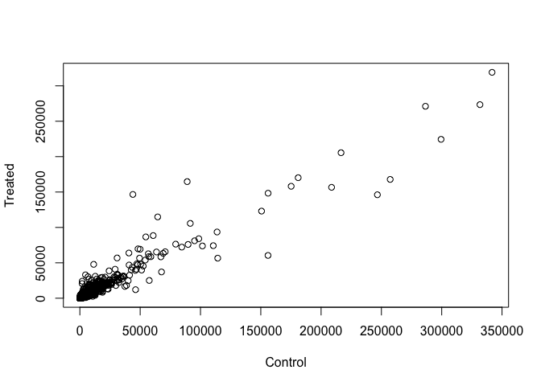
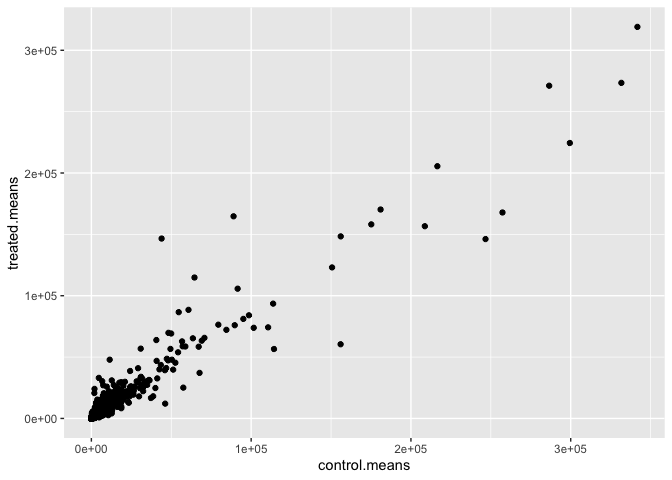
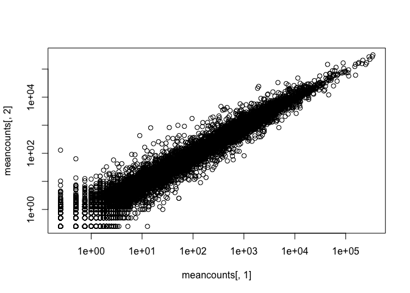
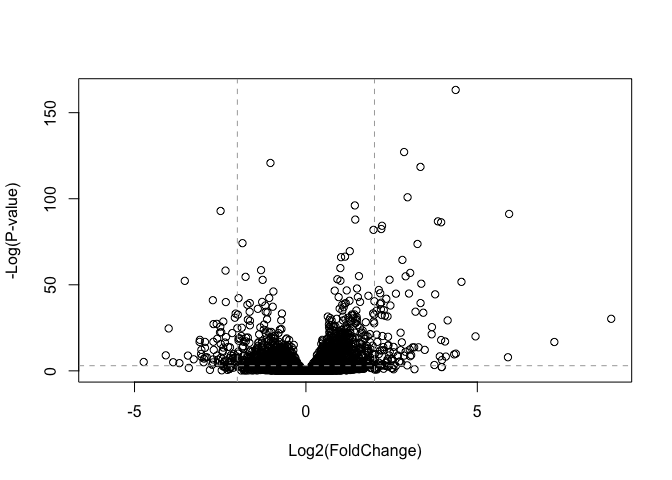
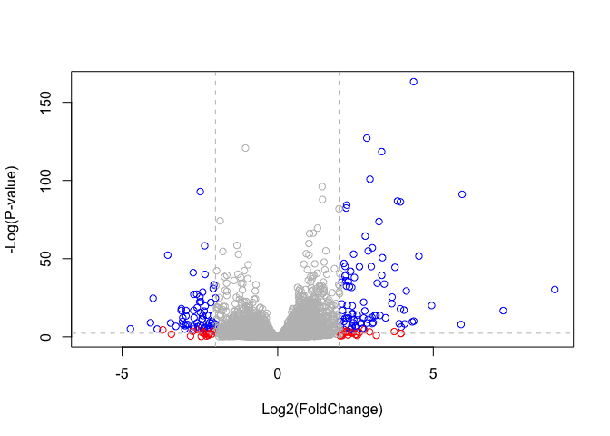

Class 12: Differential Expression Analysis
================
Nicole Chang

# 2. Import countData and colData

``` r
counts <- read.csv("airway_scaledcounts.csv", row.names= 1)
metadata <- read.csv("airway_metadata.csv")
View(counts)
View(metadata)
```

> **Q1.** How many genes are in this dataset?

In this dataset there are 38694 genes

> **Q2.** How many control cell lines do we have?

We have 4 control cell lines.

# 3. Toy differential gene expression

> Q3. How would you make the above code in either approach more robust?

``` r
metadata[,"dex"] == "control"
```

    [1]  TRUE FALSE  TRUE FALSE  TRUE FALSE  TRUE FALSE

``` r
metadata[metadata[,"dex"]=="control",]
```

              id     dex celltype     geo_id
    1 SRR1039508 control   N61311 GSM1275862
    3 SRR1039512 control  N052611 GSM1275866
    5 SRR1039516 control  N080611 GSM1275870
    7 SRR1039520 control  N061011 GSM1275874

``` r
control <- metadata[metadata[,"dex"]=="control",]
control$id
```

    [1] "SRR1039508" "SRR1039512" "SRR1039516" "SRR1039520"

``` r
control.counts <- counts[, control$id]
control.means <- rowMeans(control.counts)
```

> **Q4.** Follow the same procedure for the `treated` samples
> (i.e. calculate the mean per gene across drug treated samples and
> assign to a labeled vector called `treated.mean`)

``` r
metadata[,"dex"] == "treated"
```

    [1] FALSE  TRUE FALSE  TRUE FALSE  TRUE FALSE  TRUE

``` r
metadata[metadata[,"dex"]=="treated",]
```

              id     dex celltype     geo_id
    2 SRR1039509 treated   N61311 GSM1275863
    4 SRR1039513 treated  N052611 GSM1275867
    6 SRR1039517 treated  N080611 GSM1275871
    8 SRR1039521 treated  N061011 GSM1275875

``` r
treated <- metadata[metadata[,"dex"]=="treated",]
treated$id
```

    [1] "SRR1039509" "SRR1039513" "SRR1039517" "SRR1039521"

``` r
treated.counts <- counts[, treated$id]
treated.means <- rowMeans(treated.counts)
```

``` r
meancounts <- data.frame(control.means, treated.means)
```

``` r
colSums(meancounts)
```

    control.means treated.means 
         23005324      22196524 

> **Q5 (a).** Create a scatter plot showing the mean of the treated
> samples against the mean of the control samples.

``` r
plot(meancounts[,1], meancounts[,2], xlab = "Control", ylab = "Treated")
```



> Q5 (b). You could also use the **ggplot2** package to make this figure
> producing the plot below. What **geom\_?()** function would you use
> for this plot?

point

``` r
library(ggplot2)
ggplot(data = meancounts) +
  aes(x =control.means, y =treated.means) +
  geom_point()
```



> Q6. Try plotting both axes on a log scale. What is the argument to
> **plot()** that allows you to do this?

log

``` r
plot(meancounts[,1], meancounts[,2],log='xy')
```

    Warning in xy.coords(x, y, xlabel, ylabel, log): 15032 x values <= 0 omitted
    from logarithmic plot

    Warning in xy.coords(x, y, xlabel, ylabel, log): 15281 y values <= 0 omitted
    from logarithmic plot



``` r
log2(40/20)
```

    [1] 1

To calculate the log2 of the fold change between treated and control…

``` r
meancounts$log2fc <- log2(meancounts$treated.means/ 
                          meancounts$control.means)
```

To remove zero values

``` r
zero.vals <- which(meancounts[,1:2]==0, arr.ind=TRUE)

to.rm <- unique(zero.vals[,1])
mycounts <- meancounts[-to.rm,]
head(mycounts)
```

                    control.means treated.means      log2fc
    ENSG00000000003        900.75        658.00 -0.45303916
    ENSG00000000419        520.50        546.00  0.06900279
    ENSG00000000457        339.75        316.50 -0.10226805
    ENSG00000000460         97.25         78.75 -0.30441833
    ENSG00000000971       5219.00       6687.50  0.35769358
    ENSG00000001036       2327.00       1785.75 -0.38194109

``` r
zero.vals <- which(meancounts[,1:2] == 0, arr.ind = TRUE)
to.rm <- unique(zero.vals[,1])
mycounts <- meancounts[-to.rm,]
```

> Q7. What is the purpose of the `arr.ind` argument in the **which()**
> function call above? Why would we then take the first column of the
> output and need to call the **unique()** function?

The purpose is to tell where in the columns and rows where the
meancounts have zero counts. The unique() function gets rid of the
repetition so that we don’t count rows twice.

Overexpressed and underexpressed genes

``` r
up.ind <- mycounts$log2fc > 2
down.ind <- mycounts$log2fc < (-2)
```

> Q8. Using the `up.ind` vector above can you determine how many up
> regulated genes we have at the greater than 2 fc level?

``` r
table(up.ind)
```

    up.ind
    FALSE  TRUE 
    21567   250 

There are 250 up regulated genes at the greater than 2 fc level.

> Q9. Using the `down.ind` vector above can you determine how many down
> regulated genes we have at the greater than 2 fc level?

``` r
table(down.ind)
```

    down.ind
    FALSE  TRUE 
    21450   367 

There are 367 down regulated genes at the greater than 2 fc level.

> Q10. Do you trust these results? Why or why not?

We cannot trust these results because we haven’t done a proper
statistical analysis on whether these values are significant.

# 4. DESeq2 analysis

First step, loading the library

``` r
library(DESeq2)
```

    Loading required package: S4Vectors

    Loading required package: stats4

    Loading required package: BiocGenerics


    Attaching package: 'BiocGenerics'

    The following objects are masked from 'package:stats':

        IQR, mad, sd, var, xtabs

    The following objects are masked from 'package:base':

        anyDuplicated, aperm, append, as.data.frame, basename, cbind,
        colnames, dirname, do.call, duplicated, eval, evalq, Filter, Find,
        get, grep, grepl, intersect, is.unsorted, lapply, Map, mapply,
        match, mget, order, paste, pmax, pmax.int, pmin, pmin.int,
        Position, rank, rbind, Reduce, rownames, sapply, setdiff, sort,
        table, tapply, union, unique, unsplit, which.max, which.min


    Attaching package: 'S4Vectors'

    The following objects are masked from 'package:base':

        expand.grid, I, unname

    Loading required package: IRanges

    Loading required package: GenomicRanges

    Loading required package: GenomeInfoDb

    Loading required package: SummarizedExperiment

    Loading required package: MatrixGenerics

    Loading required package: matrixStats


    Attaching package: 'MatrixGenerics'

    The following objects are masked from 'package:matrixStats':

        colAlls, colAnyNAs, colAnys, colAvgsPerRowSet, colCollapse,
        colCounts, colCummaxs, colCummins, colCumprods, colCumsums,
        colDiffs, colIQRDiffs, colIQRs, colLogSumExps, colMadDiffs,
        colMads, colMaxs, colMeans2, colMedians, colMins, colOrderStats,
        colProds, colQuantiles, colRanges, colRanks, colSdDiffs, colSds,
        colSums2, colTabulates, colVarDiffs, colVars, colWeightedMads,
        colWeightedMeans, colWeightedMedians, colWeightedSds,
        colWeightedVars, rowAlls, rowAnyNAs, rowAnys, rowAvgsPerColSet,
        rowCollapse, rowCounts, rowCummaxs, rowCummins, rowCumprods,
        rowCumsums, rowDiffs, rowIQRDiffs, rowIQRs, rowLogSumExps,
        rowMadDiffs, rowMads, rowMaxs, rowMeans2, rowMedians, rowMins,
        rowOrderStats, rowProds, rowQuantiles, rowRanges, rowRanks,
        rowSdDiffs, rowSds, rowSums2, rowTabulates, rowVarDiffs, rowVars,
        rowWeightedMads, rowWeightedMeans, rowWeightedMedians,
        rowWeightedSds, rowWeightedVars

    Loading required package: Biobase

    Welcome to Bioconductor

        Vignettes contain introductory material; view with
        'browseVignettes()'. To cite Bioconductor, see
        'citation("Biobase")', and for packages 'citation("pkgname")'.


    Attaching package: 'Biobase'

    The following object is masked from 'package:MatrixGenerics':

        rowMedians

    The following objects are masked from 'package:matrixStats':

        anyMissing, rowMedians

``` r
citation('DESeq2')
```


    To cite package 'DESeq2' in publications use:

      Love, M.I., Huber, W., Anders, S. Moderated estimation of fold change
      and dispersion for RNA-seq data with DESeq2 Genome Biology 15(12):550
      (2014)

    A BibTeX entry for LaTeX users is

      @Article{,
        title = {Moderated estimation of fold change and dispersion for RNA-seq data with DESeq2},
        author = {Michael I. Love and Wolfgang Huber and Simon Anders},
        year = {2014},
        journal = {Genome Biology},
        doi = {10.1186/s13059-014-0550-8},
        volume = {15},
        issue = {12},
        pages = {550},
      }

Let’s generate the specific object that DESeq2 needs:

``` r
dds <- DESeqDataSetFromMatrix(countData = counts,
                              colData = metadata,
                              design = ~dex)
```

    converting counts to integer mode

    Warning in DESeqDataSet(se, design = design, ignoreRank): some variables in
    design formula are characters, converting to factors

``` r
dds
```

    class: DESeqDataSet 
    dim: 38694 8 
    metadata(1): version
    assays(1): counts
    rownames(38694): ENSG00000000003 ENSG00000000005 ... ENSG00000283120
      ENSG00000283123
    rowData names(0):
    colnames(8): SRR1039508 SRR1039509 ... SRR1039520 SRR1039521
    colData names(4): id dex celltype geo_id

``` r
dds <- DESeq(dds)
```

    estimating size factors

    estimating dispersions

    gene-wise dispersion estimates

    mean-dispersion relationship

    final dispersion estimates

    fitting model and testing

``` r
res <- results(dds)
res
```

    log2 fold change (MLE): dex treated vs control 
    Wald test p-value: dex treated vs control 
    DataFrame with 38694 rows and 6 columns
                     baseMean log2FoldChange     lfcSE      stat    pvalue
                    <numeric>      <numeric> <numeric> <numeric> <numeric>
    ENSG00000000003  747.1942     -0.3507030  0.168246 -2.084470 0.0371175
    ENSG00000000005    0.0000             NA        NA        NA        NA
    ENSG00000000419  520.1342      0.2061078  0.101059  2.039475 0.0414026
    ENSG00000000457  322.6648      0.0245269  0.145145  0.168982 0.8658106
    ENSG00000000460   87.6826     -0.1471420  0.257007 -0.572521 0.5669691
    ...                   ...            ...       ...       ...       ...
    ENSG00000283115  0.000000             NA        NA        NA        NA
    ENSG00000283116  0.000000             NA        NA        NA        NA
    ENSG00000283119  0.000000             NA        NA        NA        NA
    ENSG00000283120  0.974916      -0.668258   1.69456 -0.394354  0.693319
    ENSG00000283123  0.000000             NA        NA        NA        NA
                         padj
                    <numeric>
    ENSG00000000003  0.163035
    ENSG00000000005        NA
    ENSG00000000419  0.176032
    ENSG00000000457  0.961694
    ENSG00000000460  0.815849
    ...                   ...
    ENSG00000283115        NA
    ENSG00000283116        NA
    ENSG00000283119        NA
    ENSG00000283120        NA
    ENSG00000283123        NA

``` r
summary(res, alpha = 0.05)
```


    out of 25258 with nonzero total read count
    adjusted p-value < 0.05
    LFC > 0 (up)       : 1242, 4.9%
    LFC < 0 (down)     : 939, 3.7%
    outliers [1]       : 142, 0.56%
    low counts [2]     : 9971, 39%
    (mean count < 10)
    [1] see 'cooksCutoff' argument of ?results
    [2] see 'independentFiltering' argument of ?results

# 6. Data Visualization

``` r
plot(res$log2FoldChange, -log(res$padj),
     xlab="Log2(FoldChange)",
     ylab="-Log(P-value)")
```


``` r
plot( res$log2FoldChange,  -log(res$padj), 
 ylab="-Log(P-value)", xlab="Log2(FoldChange)")

# Add some cut-off lines
abline(v=c(-2,2), col="darkgray", lty=2)
abline(h=-log(0.05), col="darkgray", lty=2)
```



``` r
# Setup our custom point color vector 
mycols <- rep("gray", nrow(res))
mycols[ abs(res$log2FoldChange) > 2 ]  <- "red" 

inds <- (res$padj < 0.01) & (abs(res$log2FoldChange) > 2 )
mycols[ inds ] <- "blue"

# Volcano plot with custom colors 
plot( res$log2FoldChange,  -log(res$padj), 
 col=mycols, ylab="-Log(P-value)", xlab="Log2(FoldChange)" )

# Cut-off lines
abline(v=c(-2,2), col="gray", lty=2)
abline(h=-log(0.1), col="gray", lty=2)
```


