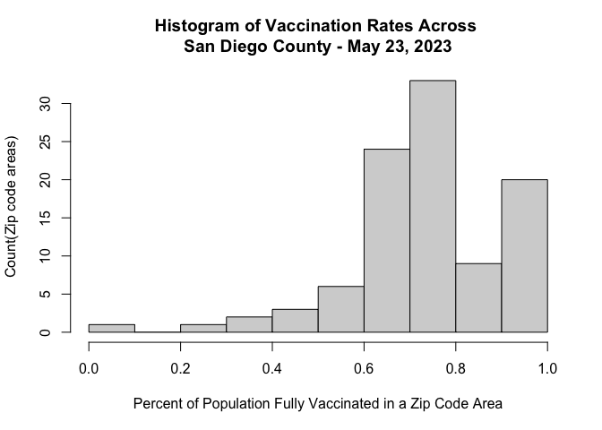
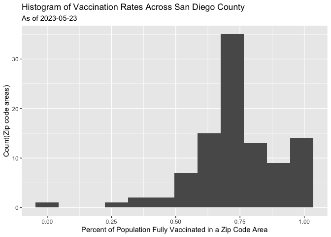
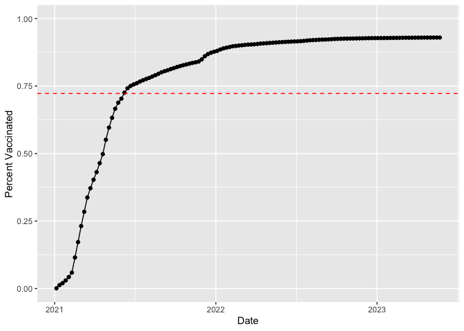
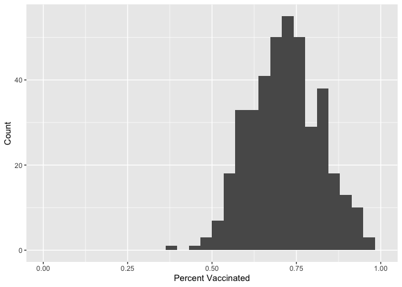
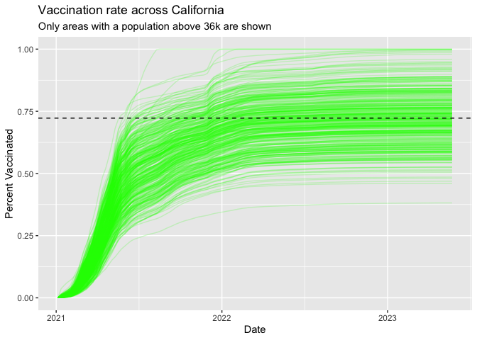

Class 17: Mini Project
================
Nicole Chang
5/26/23

# Getting Started

Download csv file and import vaccination data

``` r
vax <- read.csv(file = "covid19vaccinesbyzipcode_test.csv")
head(vax)
```

      as_of_date zip_code_tabulation_area local_health_jurisdiction      county
    1 2021-01-05                    94579                   Alameda     Alameda
    2 2021-01-05                    93726                    Fresno      Fresno
    3 2021-01-05                    94305               Santa Clara Santa Clara
    4 2021-01-05                    93704                    Fresno      Fresno
    5 2021-01-05                    94403                 San Mateo   San Mateo
    6 2021-01-05                    93668                    Fresno      Fresno
      vaccine_equity_metric_quartile                 vem_source
    1                              3 Healthy Places Index Score
    2                              1 Healthy Places Index Score
    3                              4 Healthy Places Index Score
    4                              1 Healthy Places Index Score
    5                              4 Healthy Places Index Score
    6                              1    CDPH-Derived ZCTA Score
      age12_plus_population age5_plus_population tot_population
    1               19192.7                20872          21883
    2               33707.7                39067          42824
    3               15716.9                16015          16397
    4               24803.5                27701          29740
    5               37967.5                41530          44408
    6                1013.4                 1199           1219
      persons_fully_vaccinated persons_partially_vaccinated
    1                       NA                           NA
    2                       NA                           NA
    3                       NA                           NA
    4                       NA                           NA
    5                       NA                           NA
    6                       NA                           NA
      percent_of_population_fully_vaccinated
    1                                     NA
    2                                     NA
    3                                     NA
    4                                     NA
    5                                     NA
    6                                     NA
      percent_of_population_partially_vaccinated
    1                                         NA
    2                                         NA
    3                                         NA
    4                                         NA
    5                                         NA
    6                                         NA
      percent_of_population_with_1_plus_dose booster_recip_count
    1                                     NA                  NA
    2                                     NA                  NA
    3                                     NA                  NA
    4                                     NA                  NA
    5                                     NA                  NA
    6                                     NA                  NA
      bivalent_dose_recip_count eligible_recipient_count
    1                        NA                        4
    2                        NA                        2
    3                        NA                        8
    4                        NA                        5
    5                        NA                        7
    6                        NA                        0
      eligible_bivalent_recipient_count
    1                                 4
    2                                 2
    3                                 8
    4                                 5
    5                                 7
    6                                 0
                                                                   redacted
    1 Information redacted in accordance with CA state privacy requirements
    2 Information redacted in accordance with CA state privacy requirements
    3 Information redacted in accordance with CA state privacy requirements
    4 Information redacted in accordance with CA state privacy requirements
    5 Information redacted in accordance with CA state privacy requirements
    6 Information redacted in accordance with CA state privacy requirements

> Q1. What column details the total number of people fully vaccinated?

persons_fully_vaccinated

> Q2. What column details the Zip code tabulation area?

zip_code_tabulation_area

> Q3. What is the earliest date in this dataset?

2021-01-05

> Q4. What is the latest date in this dataset?

2023-05-23

Getting a quick overview of the dataset using the `skim()` function:

``` r
skimr::skim_without_charts(vax)
```

|                                                  |        |
|:-------------------------------------------------|:-------|
| Name                                             | vax    |
| Number of rows                                   | 220500 |
| Number of columns                                | 19     |
| \_\_\_\_\_\_\_\_\_\_\_\_\_\_\_\_\_\_\_\_\_\_\_   |        |
| Column type frequency:                           |        |
| character                                        | 5      |
| numeric                                          | 14     |
| \_\_\_\_\_\_\_\_\_\_\_\_\_\_\_\_\_\_\_\_\_\_\_\_ |        |
| Group variables                                  | None   |

Data summary

**Variable type: character**

| skim_variable             | n_missing | complete_rate | min | max | empty | n_unique | whitespace |
|:--------------------------|----------:|--------------:|----:|----:|------:|---------:|-----------:|
| as_of_date                |         0 |             1 |  10 |  10 |     0 |      125 |          0 |
| local_health_jurisdiction |         0 |             1 |   0 |  15 |   625 |       62 |          0 |
| county                    |         0 |             1 |   0 |  15 |   625 |       59 |          0 |
| vem_source                |         0 |             1 |  15 |  26 |     0 |        3 |          0 |
| redacted                  |         0 |             1 |   2 |  69 |     0 |        2 |          0 |

**Variable type: numeric**

| skim_variable                              | n_missing | complete_rate |     mean |       sd |    p0 |      p25 |      p50 |      p75 |     p100 |
|:-------------------------------------------|----------:|--------------:|---------:|---------:|------:|---------:|---------:|---------:|---------:|
| zip_code_tabulation_area                   |         0 |          1.00 | 93665.11 |  1817.38 | 90001 | 92257.75 | 93658.50 | 95380.50 |  97635.0 |
| vaccine_equity_metric_quartile             |     10875 |          0.95 |     2.44 |     1.11 |     1 |     1.00 |     2.00 |     3.00 |      4.0 |
| age12_plus_population                      |         0 |          1.00 | 18895.04 | 18993.87 |     0 |  1346.95 | 13685.10 | 31756.12 |  88556.7 |
| age5_plus_population                       |         0 |          1.00 | 20875.24 | 21105.97 |     0 |  1460.50 | 15364.00 | 34877.00 | 101902.0 |
| tot_population                             |     10750 |          0.95 | 23372.77 | 22628.50 |    12 |  2126.00 | 18714.00 | 38168.00 | 111165.0 |
| persons_fully_vaccinated                   |     17711 |          0.92 | 14272.72 | 15264.17 |    11 |   954.00 |  8990.00 | 23782.00 |  87724.0 |
| persons_partially_vaccinated               |     17711 |          0.92 |  1711.05 |  2071.56 |    11 |   164.00 |  1203.00 |  2550.00 |  42259.0 |
| percent_of_population_fully_vaccinated     |     22579 |          0.90 |     0.58 |     0.25 |     0 |     0.44 |     0.62 |     0.75 |      1.0 |
| percent_of_population_partially_vaccinated |     22579 |          0.90 |     0.08 |     0.09 |     0 |     0.05 |     0.06 |     0.08 |      1.0 |
| percent_of_population_with_1\_plus_dose    |     23732 |          0.89 |     0.64 |     0.24 |     0 |     0.50 |     0.68 |     0.82 |      1.0 |
| booster_recip_count                        |     74388 |          0.66 |  6373.43 |  7751.70 |    11 |   328.00 |  3097.00 | 10274.00 |  60022.0 |
| bivalent_dose_recip_count                  |    159956 |          0.27 |  3407.91 |  4010.38 |    11 |   222.00 |  1832.00 |  5482.00 |  29484.0 |
| eligible_recipient_count                   |         0 |          1.00 | 13120.40 | 15126.17 |     0 |   534.00 |  6663.00 | 22517.25 |  87437.0 |
| eligible_bivalent_recipient_count          |         0 |          1.00 | 13016.51 | 15199.08 |     0 |   266.00 |  6562.00 | 22513.00 |  87437.0 |

> **Q5.** How many numeric columns are in this dataset?

14

> **Q6.** Note that there are "missing values" in the dataset. How many
> `NA` values there in the `persons_fully_vaccinated` column?

``` r
sum( is.na(vax$persons_fully_vaccinated) )
```

    [1] 17711

17711

> **Q7.** What percent of `persons_fully_vaccinated` values are missing
> (to 2 significant figures)?

``` r
(17711/ nrow(vax) ) * 100
```

    [1] 8.0322

8.03%

> Q8. \[Optional\]: Why might this data be missing?

People can get vaccinated but then pass away.

# Working with dates

We will be using the lubridate package

``` r
# BiocManager::install("lubridate")
library(lubridate)
```


    Attaching package: 'lubridate'

    The following objects are masked from 'package:base':

        date, intersect, setdiff, union

What is today's date:

``` r
today()
```

    [1] "2023-06-09"

How many days have passed since data was first recorded:

``` r
# This will give an Error!
# today() - vax$as_of_date[1]
```

However if we convert our date data into a lubridate format things like
this will be much easier as well as plotting time series data later on.

``` r
# Specify that we are using the year-month-day format
vax$as_of_date <- ymd(vax$as_of_date)
```

Now we can do the math with dates:

``` r
today() - vax$as_of_date[1]
```

    Time difference of 885 days

Using the last and the first date value we can now determine how many
days the dataset span?

``` r
vax$as_of_date[nrow(vax)] - vax$as_of_date[1]
```

    Time difference of 868 days

> **Q9.** How many days have passed since the last update of the
> dataset?

``` r
today() - ymd(vax$as_of_date[nrow(vax)])
```

    Time difference of 17 days

8

> **Q10.** How many unique dates are in the dataset (i.e. how many
> different dates are detailed)?

``` r
length(unique(vax$as_of_date))
```

    [1] 125

# Working with ZIP codes

Let's install and then load up this package and to find the centroid of
the La Jolla 92037 (i.e. UC San Diego) ZIP code area.

``` r
library(zipcodeR)
```

    The legacy packages maptools, rgdal, and rgeos, underpinning this package
    will retire shortly. Please refer to R-spatial evolution reports on
    https://r-spatial.org/r/2023/05/15/evolution4.html for details.
    This package is now running under evolution status 0 

``` r
geocode_zip('92037')
```

    # A tibble: 1 × 3
      zipcode   lat   lng
      <chr>   <dbl> <dbl>
    1 92037    32.8 -117.

Calculate the distance between the centroids of any two ZIP codes in
miles, e.g.

``` r
zip_distance('92037','92109')
```

      zipcode_a zipcode_b distance
    1     92037     92109     2.33

More usefully, we can pull census data about ZIP code areas (including
median household income etc.).

``` r
reverse_zipcode(c('92037', "92109") )
```

    # A tibble: 2 × 24
      zipcode zipcode_type major_city post_office_city common_city_list county state
      <chr>   <chr>        <chr>      <chr>                      <blob> <chr>  <chr>
    1 92037   Standard     La Jolla   La Jolla, CA           <raw 20 B> San D… CA   
    2 92109   Standard     San Diego  San Diego, CA          <raw 21 B> San D… CA   
    # ℹ 17 more variables: lat <dbl>, lng <dbl>, timezone <chr>,
    #   radius_in_miles <dbl>, area_code_list <blob>, population <int>,
    #   population_density <dbl>, land_area_in_sqmi <dbl>,
    #   water_area_in_sqmi <dbl>, housing_units <int>,
    #   occupied_housing_units <int>, median_home_value <int>,
    #   median_household_income <int>, bounds_west <dbl>, bounds_east <dbl>,
    #   bounds_north <dbl>, bounds_south <dbl>

We can use this `reverse_zipcode()` to pull census data later on for any
or all ZIP code areas we might be interested in.

``` r
# Pull data for all ZIP codes in the dataset
zipdata <- reverse_zipcode( vax$zip_code_tabulation_area )
```

# Focus on the San Diego area

Let's now focus in on the San Diego County area by restricting ourselves
first to `vax$county == "San Diego"` entries.

``` r
# Subset to San Diego county only areas
sd <- vax[ vax$county == 'San Diego' , ]
```

Using dplyr

``` r
library(dplyr)
```


    Attaching package: 'dplyr'

    The following objects are masked from 'package:stats':

        filter, lag

    The following objects are masked from 'package:base':

        intersect, setdiff, setequal, union

``` r
sd <- filter(vax, county == "San Diego")

nrow(sd)
```

    [1] 13375

Using **dplyr** is often more convenient when we are subsetting across
multiple criteria - for example all San Diego county areas with a
population of over 10,000.

``` r
sd.10 <- filter(vax, county == "San Diego" &
                age5_plus_population > 10000)
```

> **Q11.** How many distinct zip codes are listed for San Diego County?

``` r
length(unique(sd$zip_code_tabulation_area))
```

    [1] 107

> **Q12.** What San Diego County Zip code area has the largest
> population in this dataset?

``` r
the_largest_population = sd[sd$age5_plus_population == max (sd$age5_plus_population), ]
unique(the_largest_population$zip_code_tabulation_area)
```

    [1] 92154

92154

> **Q13.** What is the overall average (with 2 decimal numbers) "Percent
> of Population Fully Vaccinated" value for all San Diego "County" as of
> "2023-05-23"?

``` r
sd_may23 <- filter(sd, as_of_date == '2023-05-23')
mean(sd_may23$percent_of_population_fully_vaccinated, na.rm = TRUE)
```

    [1] 0.7419654

74%

> **Q14.** Using either ggplot or base R graphics make a summary figure
> that shows the distribution of Percent of Population Fully Vaccinated
> values as of "2023-05-23"?

``` r
sd_may23 <- filter(vax, county == 'San Diego' &
                     as_of_date == '2023-05-23')
```

``` r
hist(sd_may23$percent_of_population_fully_vaccinated,
     xlab = 'Percent of Population Fully Vaccinated in a Zip Code Area',
     main = 'Histogram of Vaccination Rates Across \nSan Diego County - May 23, 2023',
     ylab = 'Count(Zip code areas)')
```



ggplot2 option

``` r
library(ggplot2)
ggplot(sd_may23) +
  aes(percent_of_population_fully_vaccinated) +
  geom_histogram(bins = 12) +
  ggtitle('Histogram of Vaccination Rates Across \nSan Diego County - May 23, 2023') +
  labs(title = 'Histogram of Vaccination Rates Across San Diego County',
       subtitle = 'As of 2023-05-23',
       x = 'Percent of Population Fully Vaccinated in a Zip Code Area',
       y = 'Count(Zip code areas)')
```

    Warning: Removed 8 rows containing non-finite values (`stat_bin()`).



# Focus on UCSD/La Jolla

UC San Diego resides in the 92037 ZIP code area and is listed with an
age 5+ population size of 36,144.

``` r
ucsd <- filter(sd, zip_code_tabulation_area=="92037")
ucsd[1,]$age5_plus_population
```

    [1] 36144

> **Q15**. Using **`ggplot`** make a graph of the vaccination rate time
> course for the 92037 ZIP code area:

``` r
p <- ggplot(ucsd) +
  aes(as_of_date,
      percent_of_population_fully_vaccinated) +
  geom_point() +
  geom_line(group=1) +
  ylim(c(0,1)) +
  labs(x='Date', y="Percent Vaccinated")
```

# Comparing to similar sized areas

Let's return to the full dataset and look across every zip code area
with a population at least as large as that of 92037 on *as_of_date*
"2023-05-23".

``` r
# Subset to all CA areas with a population as large as 92037
vax.36 <- filter(vax, age5_plus_population > 36144 &
                as_of_date == "2023-05-23")
```

> **Q16**. Calculate the mean *"Percent of Population Fully Vaccinated"*
> for ZIP code areas with a population as large as 92037 (La Jolla)
> *as_of_date* "2023-05-23". Add this as a straight horizontal line to
> your plot from above with the `geom_hline()` function?

``` r
mean_percent_pop_fully_vaccinated <- mean(vax.36$percent_of_population_fully_vaccinated)
```

``` r
p + geom_hline(yintercept = mean_percent_pop_fully_vaccinated,
               linetype = 'dashed',
               color = 'red')
```



> **Q17.** What is the 6 number summary (Min, 1st Qu., Median, Mean, 3rd
> Qu., and Max) of the *"Percent of Population Fully Vaccinated"* values
> for ZIP code areas with a population as large as 92037 (La Jolla)
> *as_of_date* "2023-05-23"?

``` r
summary(vax.36$percent_of_population_fully_vaccinated)
```

       Min. 1st Qu.  Median    Mean 3rd Qu.    Max. 
     0.3816  0.6469  0.7207  0.7226  0.7924  1.0000 

> **Q18.** Using ggplot generate a histogram of this data.

``` r
ggplot(vax.36) +
  aes(percent_of_population_fully_vaccinated) +
  xlim(c(0,1)) +
  geom_histogram() +
  labs(x = 'Percent Vaccinated',
       y = 'Count')
```

    `stat_bin()` using `bins = 30`. Pick better value with `binwidth`.

    Warning: Removed 2 rows containing missing values (`geom_bar()`).



> **Q19**. Is the 92109 and 92040 ZIP code areas above or below the
> average value you calculated for all these above?

``` r
vax %>% filter(as_of_date == "2023-05-23") %>%  
  filter(zip_code_tabulation_area=="92040") %>%
  select(percent_of_population_fully_vaccinated)
```

      percent_of_population_fully_vaccinated
    1                               0.552434

``` r
vax %>% filter(as_of_date == "2023-05-23") %>%  
  filter(zip_code_tabulation_area=="92109") %>%
  select(percent_of_population_fully_vaccinated)
```

      percent_of_population_fully_vaccinated
    1                                0.69487

It is above.

> **Q20.** Finally make a time course plot of vaccination progress for
> all areas in the full dataset with a `age5_plus_population > 36144`.

``` r
vax.36.all <- filter(vax, age5_plus_population > 36144)


ggplot(vax.36.all) +
  aes(x = ymd(as_of_date),
      y = percent_of_population_fully_vaccinated, 
      group=zip_code_tabulation_area) +
  geom_line(alpha=0.2, color='green') +
  ylim(c(0,1)) +
  labs(x='Date', y='Percent Vaccinated',
       title='Vaccination rate across California',
       subtitle='Only areas with a population above 36k are shown') +
  geom_hline(yintercept = mean_percent_pop_fully_vaccinated, linetype='dashed')
```

    Warning: Removed 185 rows containing missing values (`geom_line()`).


